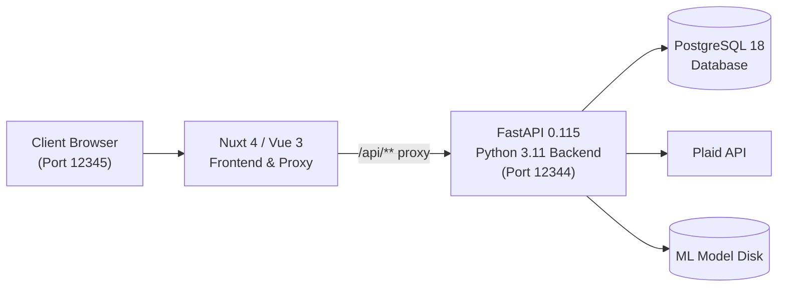

# Personal Budget App 💰

A full-stack, zero-based personal budgeting web application built with **FastAPI**, **Nuxt 4**, **Vue 3**, **SQLAlchemy**, and **PostgreSQL**.

Inspired by EveryDollar and YNAB, this application gives every dollar a job. It supports automated bank syncing via **Plaid** as well as offline statement importing via **bank CSV exports** (USAA, Discover, and custom user-defined formats).

---

## 🌟 Key Features

- **Zero-Based Budgeting:** Balance your monthly budget so that $\text{Income Planned} - \text{Expenses Planned} = 0$ ("Every dollar has a job!").
- **Unified Categories & Budget Planner:** Reorder categories and groups using drag-and-drop (`vuedraggable`), inspect planned vs. actual numbers, and edit monthly budgets inline.
- **Credit Card Engine:** Track rolling credit debt (`balance_owed = starting_balance + all-time net transactions`), monitor monthly charges and payments, and handle overpayments cleanly.
- **Automated Transfer Matching:** Heuristic engine detects inter-account transfers (e.g. credit card payments, checking &rarr; savings transfers) within a 2-day window across accounts.
- **Account Reconciliation:** First-class reconciliation workflow comparing cleared transactions against bank statement balances, with atomic locking and watermark tracking.
- **Merchant Normalization:** Automatically derives clean, normalized merchant names from messy bank narratives while preserving the raw imported description.
- **Categorization Rules:** Canonical merchant-to-category matching rules (`clean_merchant_key(merchant)` &rarr; `category_id`) with on-staging application and retroactive bulk execution.
- **Machine Learning Category Suggestions:** Local scikit-learn classifier (TF-IDF character n-grams + Logistic Regression) surfacing suggestions with operating confidence scores (0.30 threshold); suggestion-only workflow never silently alters records.
- **Recurring Transaction Detection:** Identifies repeating series across posted transactions by `(account_id, merchant, direction)` across weekly, biweekly, monthly, and annual cadences.
- **Split Transactions:** Allocate a single parent transaction across multiple budget categories with exact sum Decimal validation, preserving parent financial integrity.
- **Statement CSV Upload Wizard:** Upload-first workflow with automatic header detection, custom bank format mapping & persistence, row-level preview, validation, and exact duplicate detection.
- **Automated Bank Sync (Plaid):** Link financial institutions to automatically sync accounts, balances, and transactions, with conflict protections for reconciled transactions and split deallocation on provider correction.
- **Interactive Dashboard:** High-level monthly overview showing liquid cash, credit card debt totals, spending distributions, actionable alerts ("Needs Attention"), and recent activity.
- **Transaction Workspace:** Primary ledger with route-query synchronized filters, text search, review flags, transfer pairing, split allocation modals, and suggestion chips.

---

## 🏗️ Architecture & Tech Stack



- **Frontend:** Nuxt 4, Vue 3 (Composition API), TypeScript, VueDraggable, centralized design tokens (`tokens.css`, `base.css`).
- **Backend:** FastAPI, Python 3.11, SQLAlchemy 2.x, Pydantic v2, scikit-learn. Organized using Volatility-Based Decomposition (VBD) into 11 Presentation routers, 13 workflow Managers, 8 pure calculation Engines & domain policies, 3 pure domain Utilities, and 12 concrete ResourceAccess modules.
- **Database:** PostgreSQL 18 with UUID primary keys and exact fixed-point decimals (`DECIMAL(10,2)` / `DECIMAL(12,2)`).
- **Deployment:** Docker & Docker Compose.

---

## 🚀 Quick Start (Docker Compose)

The fastest way to launch the entire stack is with Docker Compose:

### 1. Configure Environment
Ensure you have a `.env` file in the root directory:
```bash
POSTGRES_PORT=5432
POSTGRES_USER=budget_user
POSTGRES_PASSWORD=budget_secret
POSTGRES_DATABASE=budget_app

# Plaid API (Optional - required only for live bank sync)
PLAID_CLIENT_ID=your_plaid_client_id
PLAID_SECRET=your_plaid_secret
PLAID_ENVIRONMENT=Sandbox
```

### 2. Launch Stack
```bash
docker-compose up --build
```

### 3. Access Services
- **Web App:** [http://localhost:12345](http://localhost:12345)
- **FastAPI Documentation:** [http://localhost:12344/docs](http://localhost:12344/docs)
- **Database:** `localhost:5432`

---

## 💻 Local Development (Without Docker)

### Backend Setup
```bash
# 1. Start a local Postgres instance or container
docker run --name budget-db -e POSTGRES_DB=budget_app -e POSTGRES_USER=budget_user -e POSTGRES_PASSWORD=budget_secret -p 5432:5432 -d postgres:18

# 2. Virtual environment & dependencies
python3.11 -m venv .venv
source .venv/bin/activate
pip install -r backend/requirements.txt

# 3. Start backend API
uvicorn backend.main:app --reload --port 8000
```

### Frontend Setup
```bash
cd frontend
npm install
npm run dev
# Frontend runs on http://localhost:3000
```

---

## 🧪 Testing & Data Seeding

Run the automated backend test suite:
```bash
# Run all unit, integration, and characterization tests
python3 -m pytest
```

Run smoke tests against a running backend:
```bash
python3 tests/smoke_test.py
```

Verify the frontend production build:
```bash
cd frontend && npm run build
```

Populate the database with realistic multi-month test data:
```bash
# Seed demo categories, accounts, budgets, and transactions
python3 tests/seed_comprehensive.py

# Or wipe and re-seed clean:
python3 tests/seed_comprehensive.py --clean
```

---

## 📁 Repository Structure

```
├── backend/
│   ├── main.py                     # FastAPI entry point, lifespan migrations & CORS
│   ├── models.py                   # 11 SQLAlchemy ORM models
│   ├── schemas.py                  # Pydantic v2 request/response schemas
│   ├── database.py                 # DB engine, session factory, 7 idempotent migration helpers
│   ├── initial_data.py             # Default category groups and categories
│   ├── bank_statement_loader.py    # BankStatementLoader ABC, USAA/Discover, Mapped loader, detection
│   ├── security.py                 # Plaid token encoding placeholder (base64)
│   ├── access/                     # 12 Concrete ResourceAccess modules
│   │   ├── account_access.py
│   │   ├── budget_access.py
│   │   ├── category_access.py
│   │   ├── categorization_rule_access.py
│   │   ├── csv_format_access.py
│   │   ├── ml_model_access.py
│   │   ├── plaid_access.py
│   │   ├── plaid_item_access.py
│   │   ├── plaid_transaction_access.py
│   │   ├── recurring_access.py
│   │   ├── split_access.py
│   │   └── transaction_access.py
│   ├── domain/                     # 8 Pure Calculation Engines & Policies + 3 Pure Domain Utilities
│   │   # Engines & Domain Policies:
│   │   ├── account_reconciliation.py # Cleared balance arithmetic, statement difference, balanced state
│   │   ├── budgeting.py            # Zero-based budgeting calculations
│   │   ├── credit_cards.py         # Credit card balance and metric calculations
│   │   ├── merchant_normalization.py # Merchant cleaning heuristics, pattern stripping, fallback policy
│   │   ├── ml_categorization.py    # ML inference, training pipeline, quality gates
│   │   ├── reconciliation.py       # Transfer candidate matching heuristic
│   │   ├── recurring_transactions.py # Cadence clustering and variance filtering
│   │   ├── transaction_splits.py   # Split allocation business invariants (sum exactness, sign matching)
│   │   # Domain Utilities:
│   │   ├── accounts.py             # Depository balance subtraction formula
│   │   ├── categorization_rules.py # Merchant canonical key normalization helper for narrow Phase 9 model
│   │   └── dates.py                # Month range and date helpers
│   ├── managers/                   # 13 Workflow orchestration Managers
│   │   ├── account_reconciliation_manager.py
│   │   ├── account_summary_manager.py
│   │   ├── budget_summary_manager.py
│   │   ├── categorization_rule_manager.py
│   │   ├── credit_card_summary_manager.py
│   │   ├── csv_import_manager.py
│   │   ├── dashboard_summary_manager.py
│   │   ├── ml_categorization_manager.py
│   │   ├── plaid_account_sync_manager.py
│   │   ├── plaid_transaction_sync_manager.py
│   │   ├── recurring_transaction_manager.py
│   │   ├── transaction_split_manager.py
│   │   └── transfer_reconciliation_manager.py
│   └── routers/                    # 11 Presentation route handlers
│       ├── accounts.py
│       ├── budgets.py
│       ├── categories.py
│       ├── credit_cards.py
│       ├── ml.py
│       ├── plaid.py
│       ├── recurring.py
│       ├── rules.py
│       ├── summaries.py
│       ├── transactions.py
│       └── upload.py
├── frontend/
│   ├── app/
│   │   ├── app.vue                 # Persistent sidebar & root layout
│   │   ├── tokens.css              # Centralized CSS design tokens
│   │   ├── base.css                # Base stylesheet & utilities
│   │   ├── components/             # Reusable UI primitives (AppDialog, MonthNavigator, etc.)
│   │   ├── composables/            # useBudgetMonth, useTransactionFilters, useAccountTypes
│   │   └── pages/
│   │       ├── dashboard.vue       # Liquid cash, credit debt, category spending, action cards
│   │       ├── categories.vue      # Category admin & zero-based budget planner
│   │       ├── transactions.vue    # Transaction ledger, persistent filters, splits, review
│   │       ├── accounts.vue        # Accounts, ledger balances, Account Reconciliation modal
│   │       ├── credit-cards.vue    # Specialized credit card debt tracking
│   │       ├── upload.vue          # Upload-first CSV inspection, preview & import
│   │       └── settings.vue        # Categorization Rules management
│   ├── nuxt.config.ts              # Nuxt configuration & /api/** proxy
│   └── package.json
├── docs/                           # Documentation
│   ├── PRODUCT_REDESIGN_PLAN.md    # Product redesign strategy & completed phases
│   ├── TODO.md                     # Canonical TODO and active roadmap
│   ├── architecture/               # Volatility-Based Decomposition specs
│   │   ├── current-state.md        # Architecture overview & component map
│   │   ├── volatility-map.md       # Decomposition strategy & boundary matrix
│   │   ├── refactor-safety.md      # Characterization test safety & invariants
│   │   └── ...                     # Workflow specifications
│   └── old_architecture/           # Foundational guides & domain reference
│       ├── ARCHITECTURE.md         # System design, domain math, accounting rules
│       ├── API_REFERENCE.md        # REST endpoint reference & schemas
│       ├── DATA_MODEL.md           # PostgreSQL schemas, ERD, and constraints
│       ├── CSV_IMPORT_GUIDE.md     # Statement parser & custom format guide
│       └── DEVELOPMENT.md          # Local setup, seeding, and troubleshooting
├── tests/                          # Automated pytest suite (946 tests) & seed utilities
├── docker-compose.yml              # Multi-container orchestration
└── README.md
```

---

## 📖 Deep-Dive Documentation

For detailed guides, please refer to the `docs/` folder:
- [Product Redesign Plan](docs/PRODUCT_REDESIGN_PLAN.md)
- [Canonical TODO & Roadmap](docs/TODO.md)
- [Current State Architecture](docs/architecture/current-state.md)
- [VBD Volatility Map](docs/architecture/volatility-map.md)
- [Refactor Safety & Invariants](docs/architecture/refactor-safety.md)
- [Architecture & Accounting Logic](docs/old_architecture/ARCHITECTURE.md)
- [REST API Reference](docs/old_architecture/API_REFERENCE.md)
- [Database Schema & ERD](docs/old_architecture/DATA_MODEL.md)
- [CSV Statement Import Guide](docs/old_architecture/CSV_IMPORT_GUIDE.md)
- [Developer Guide & Troubleshooting](docs/old_architecture/DEVELOPMENT.md)