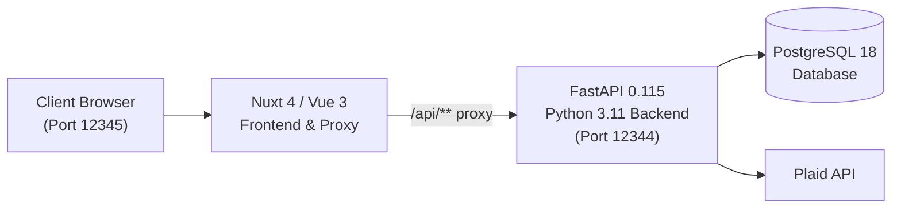

# Personal Budget App 💰

A full-stack, zero-based personal budgeting web application built with **FastAPI**, **Nuxt 4**, **Vue 3**, **SQLAlchemy**, and **PostgreSQL**.

Inspired by EveryDollar and YNAB, this application gives every dollar a job. It supports automated bank syncing via **Plaid** as well as offline statement importing via **bank CSV exports** (USAA, Discover, extensible).

---

## 🌟 Key Features

- **Zero-Based Budgeting:** Balance your monthly budget so that $\text{Income Planned} - \text{Expenses Planned} = 0$ ("Every dollar has a job!").
- **Unified Categories & Budget Planner:** Reorder categories and groups using drag-and-drop (`vuedraggable`), inspect planned vs. actual numbers, and edit monthly budgets inline.
- **Credit Card Engine:** Track rolling credit debt (`balance_owed = starting_balance + all-time net transactions`), monitor monthly charges and payments, and review transactions.
- **Automated Transfer Matching:** Heuristic engine detects inter-account transfers (e.g. credit card payments, checking &rarr; savings transfers) within a 2-day window across accounts.
- **Statement CSV Upload Wizard:** Multi-step wizard supporting USAA and Discover CSV exports with row preview, validation, and duplicate detection.
- **Automated Bank Sync (Plaid):** Link financial institutions to automatically sync accounts, balances, and transactions.
- **Interactive Dashboard:** High-level monthly overview showing income, spending, group distributions, account balances, and recent activity.
- **Transaction Ledger:** Paginated transaction ledger with real-time text search, account filtering, category assignment, and uncategorized quick-filters.

---

## 🏗️ Architecture & Tech Stack



- **Frontend:** Nuxt 4, Vue 3 (Composition API), TypeScript, VueDraggable, custom CSS variables.
- **Backend:** FastAPI, Python 3.11, SQLAlchemy 2.x, Pydantic v2, python-multipart.
- **Database:** PostgreSQL 18 with UUID primary keys and exact fixed-point decimals (`DECIMAL(10,2)` / `DECIMAL(12,2)`).
- **Deployment:** Docker & Docker Compose.

---

## 🚀 Quick Start (Docker Compose)

The fastest way to launch the entire stack is with Docker Compose:

### 1. Configure Environment
Ensure you have a `.env` file in the root directory:
```bash
POSTGRES_PORT=5432
POSTGRES_USER=budget_user
POSTGRES_PASSWORD=budget_secret
POSTGRES_DATABASE=budget_app

# Plaid API (Optional - required only for live bank sync)
PLAID_CLIENT_ID=your_plaid_client_id
PLAID_SECRET=your_plaid_secret
PLAID_ENVIRONMENT=Sandbox
```

### 2. Launch Stack
```bash
docker-compose up --build
```

### 3. Access Services
- **Web App:** [http://localhost:12345](http://localhost:12345)
- **FastAPI Documentation:** [http://localhost:12344/docs](http://localhost:12344/docs)
- **Database:** `localhost:5432`

---

## 💻 Local Development (Without Docker)

### Backend Setup
```bash
# 1. Start a local Postgres instance or container
docker run --name budget-db -e POSTGRES_DB=budget_app -e POSTGRES_USER=budget_user -e POSTGRES_PASSWORD=budget_secret -p 5432:5432 -d postgres:18

# 2. Virtual environment & dependencies
python3.11 -m venv .venv
source .venv/bin/activate
pip install -r backend/requirements.txt

# 3. Start backend API
uvicorn backend.main:app --reload --port 8000
```

### Frontend Setup
```bash
cd frontend
npm install
npm run dev
# Frontend runs on http://localhost:3000
```

---

## 🧪 Testing & Data Seeding

Run the smoke test suite to verify backend health:
```bash
python3 tests/smoke_test.py
```

Populate the database with realistic multi-month test data:
```bash
# Seed demo categories, accounts, budgets, and transactions
python3 tests/seed_comprehensive.py

# Or wipe and re-seed clean:
python3 tests/seed_comprehensive.py --clean
```

---

## 📁 Repository Structure

```
├── backend/
│   ├── main.py                     # FastAPI entry point & CORS configuration
│   ├── models.py                   # SQLAlchemy ORM models (UUID PKs, decimals)
│   ├── schemas.py                  # Pydantic v2 request/response schemas
│   ├── database.py                 # DB engine and session factory
│   ├── initial_data.py             # Default category groups and categories
│   ├── bank_statement_loader.py    # BankStatementLoader ABC (USAA, Discover)
│   ├── security.py                 # Plaid token encryption utilities
│   ├── crud/                       # Database query and persistence layer
│   │   ├── budget.py
│   │   ├── category.py
│   │   ├── plaid.py
│   │   └── transaction.py
│   └── routers/                    # FastAPI route handlers
│       ├── accounts.py
│       ├── budgets.py
│       ├── categories.py
│       ├── credit_cards.py
│       ├── plaid.py
│       ├── summaries.py
│       ├── transactions.py
│       └── upload.py
├── frontend/
│   ├── app/
│   │   ├── app.vue                 # Persistent sidebar & root layout
│   │   ├── composables/            # useAccountTypes composable
│   │   └── pages/
│   │       ├── dashboard.vue       # KPI cards, accounts, recent transactions
│   │       ├── categories.vue      # Merged category admin & monthly budget planner
│   │       ├── transactions.vue    # Searchable, filterable transaction ledger
│   │       ├── accounts.vue        # Account management & balances
│   │       ├── credit-cards.vue    # Credit debt, payments, transfer review
│   │       ├── upload.vue          # 4-step CSV statement upload wizard
│   │       └── settings.vue        # Settings placeholder
│   ├── nuxt.config.ts              # Nuxt configuration & /api/** proxy
│   └── package.json
├── docs/                           # In-depth architectural & API documentation
│   ├── ARCHITECTURE.md             # System design, domain math, accounting rules
│   ├── API_REFERENCE.md            # Comprehensive REST endpoint documentation
│   ├── DATA_MODEL.md               # PostgreSQL schemas, ERD, and constraints
│   ├── CSV_IMPORT_GUIDE.md         # Guide for statement parsers & new formats
│   └── DEVELOPMENT.md              # Local setup, seeding, and troubleshooting
├── tests/
│   ├── smoke_test.py               # Automated endpoint smoke test
│   ├── seed_comprehensive.py       # Rich multi-month test data seeder
│   └── generate_sandbox_tx.py      # Plaid sandbox test transaction utility
├── docker-compose.yml              # Multi-container orchestration
└── README.md
```

---

## 📖 Deep-Dive Documentation

For detailed guides, please refer to the `docs/` folder:
- [Architecture & Accounting Logic](docs/ARCHITECTURE.md)
- [REST API Reference](docs/API_REFERENCE.md)
- [Database Schema & ERD](docs/DATA_MODEL.md)
- [CSV Statement Import Guide](docs/CSV_IMPORT_GUIDE.md)
- [Developer Guide & Troubleshooting](docs/DEVELOPMENT.md)