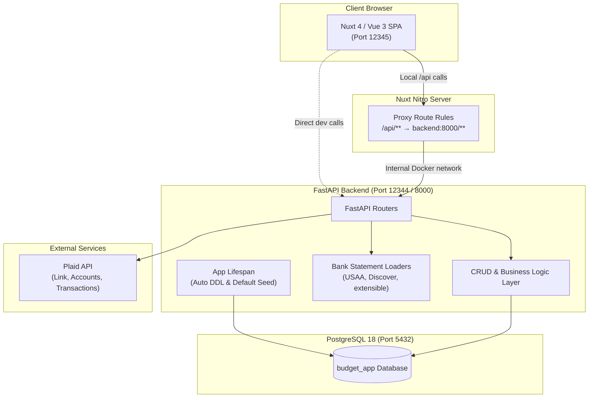
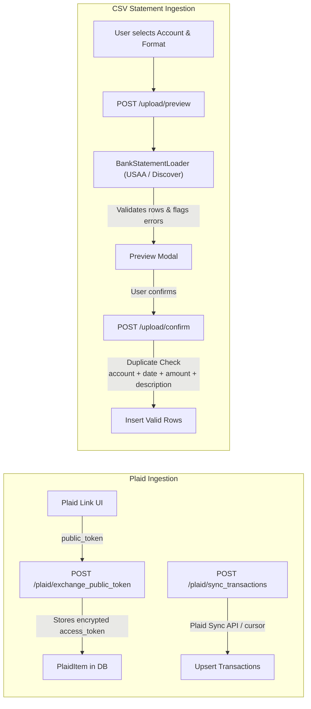

# System Architecture

This document describes the high-level architecture, design patterns, domain logic, and component interactions of the Personal Budget App.

---

## 1. System Overview

The Personal Budget App is a full-stack personal finance application designed around the **zero-based budgeting methodology** (assign every dollar a job). It supports dual ingestion methods for financial data: automated bank syncing via **Plaid** and manual statement importing via **CSV bank exports**.

---

## 2. Technology Stack

| Layer | Technology | Version / Details | Purpose |
|---|---|---|---|
| **Frontend Framework** | [Nuxt](https://nuxt.com/) | 4.2+ | Modern SSR/SPA framework with file-based routing and Vite |
| **UI Library** | [Vue.js](https://vuejs.org/) | 3.5+ | Composition API, `<script setup>`, reactive state |
| **Drag & Drop** | [vuedraggable](https://github.com/SortableJS/vue.draggable.next) | 4.1+ | Reordering category groups and categories |
| **Backend Framework** | [FastAPI](https://fastapi.tiangolo.com/) | 0.115+ | High-performance Python web API with OpenAPI/Swagger docs |
| **ORM / Data Layer** | [SQLAlchemy](https://www.sqlalchemy.org/) | 2.x | Relational mapping, eager loading (`selectinload`, `joinedload`) |
| **Data Validation** | [Pydantic](https://docs.pydantic.dev/) | 2.x | Schema validation, `ConfigDict(from_attributes=True)`, `condecimal` |
| **Database** | [PostgreSQL](https://www.postgresql.org/) | 18 | Relational database with UUID keys and numeric decimals |
| **Bank Sync** | [Plaid Python SDK](https://github.com/plaid/plaid-python) | Latest | Bank authentication and transaction synchronization |
| **CSV Parsing** | Python Standard Library | `csv`, `io` | Custom statement parser abstraction for bank CSVs |
| **Containerization** | [Docker Compose](https://docs.docker.com/compose/) | 3.8+ | Multi-container orchestration (backend, frontend, postgres) |

---

## 3. Core Domain Concepts & Business Rules

### 3.1 Transaction Amount Sign Convention

All transaction records follow a strict accounting sign convention across the entire database:

$$\text{Outflow (Spending / Charges / Debits)} > 0 \quad (\text{Positive})$$
$$\text{Inflow (Income / Deposits / Credits)} < 0 \quad (\text{Negative})$$

- **Purchases & Expenses:** When money leaves an account (e.g. paying \$50 for groceries), `amount = 50.00`.
- **Income & Deposits:** When money enters an account (e.g. paycheck of \$2,500), `amount = -2500.00`.
- **Credit Card Charges:** Buying an item on credit increases balance owed; `amount = 45.00`.
- **Credit Card Payments:** Money sent from checking to credit card reduces debt; appears as `amount = -150.00` on the credit card account and `amount = 150.00` on the checking account.

### 3.2 Zero-Based Budgeting (ZBB) Calculation

The core philosophy assigns every dollar of expected income to a specific category:

$$\text{To Be Assigned} = \text{Total Income Planned} - \text{Total Expense Planned}$$

- When $\text{To Be Assigned} = 0$: **"Every dollar has a job!"** The budget is balanced.
- When $\text{To Be Assigned} > 0$: Unassigned funds remain to be allocated.
- When $\text{To Be Assigned} < 0$: The user is over-budgeted.

#### Monthly Category Actuals & Remaining Math
In [`backend/routers/summaries.py`](file:///Users/west/programming_stuff/budget_app/backend/routers/summaries.py):
- **For `type == "expense"` categories:**
  - $\text{Actual} = \sum \text{Transaction.amount}$ (where amount > 0 for outflows)
  - $\text{Remaining} = \text{Planned} - \text{Actual}$
  - $\text{Is Over Budget} = \text{Actual} > \text{Planned}$
- **For `type == "income"` categories:**
  - Transactions for income are stored as negative numbers (inflow), so:
  - $\text{Actual} = -1 \times \sum \text{Transaction.amount}$
  - $\text{Remaining} = \text{Planned} - \text{Actual}$
  - $\text{Is Over Budget} = \text{Actual} < \text{Planned}$ (i.e. did not meet planned income goal)

### 3.3 Credit Card Debt & Balance Model

Credit cards require special handling because balances accumulate over time and payments cross accounts:

1. **Balance Owed Formula:**
   $$\text{Balance Owed} = \text{Starting Balance} + \sum_{\text{all-time}} \text{Transaction.amount}$$
   Since charges are positive and payments/credits are negative, the all-time net sum directly yields the current unpaid debt.
2. **Monthly Charges:**
   $$\text{Charges This Month} = \sum \text{Transaction.amount} \quad \text{where } \text{amount} > 0 \text{ and } \text{is\_transfer} = \text{False}$$
3. **Monthly Payments:**
   $$\text{Payments Received} = \left| \sum \text{Transaction.amount} \right| \quad \text{where } \text{amount} < 0$$

### 3.4 Automated Inter-Account Transfer Matching

Credit card payments or checking-to-savings transfers generate two distinct records:
1. An outflow on Account A (+X)
2. An inflow on Account B (-X)

If unaddressed, these would distort spending and income reports. The backend transfer engine in [`backend/routers/credit_cards.py`](file:///Users/west/programming_stuff/budget_app/backend/routers/credit_cards.py#L122-L195) provides an automated heuristic:
- Matches any unlinked inflow (`amount < 0`, `is_transfer == False`) on one account with an unlinked outflow (`amount > 0`, `is_transfer == False`) on a *different* account.
- **Criteria:** Exactly identical absolute amount and $| \text{date}_{\text{outflow}} - \text{date}_{\text{inflow}} | \le 2\text{ days}$.
- Returns pairs as candidate transfers for user review or batch approval via `POST /credit-cards/mark-transfers`.

---

## 4. Ingestion Architecture

### 4.1 Plaid Integration
- Uses Plaid Link token workflow.
- Securely stores the access token encrypted with base64 (production upgrade planned for Fernet/KMS).
- Tracks `transactions_cursor` on the `PlaidItem` model for incremental synchronization.
- Maps Plaid account categories to application account types (`depository`, `credit`, `investment`, `loan`, `other`).

### 4.2 Bank Statement Loader Pattern
- Implemented as an extensible Abstract Base Class (`BankStatementLoader` in [`backend/bank_statement_loader.py`](file:///Users/west/programming_stuff/budget_app/backend/bank_statement_loader.py)).
- Subclasses define:
  - `column_map`: header mapping from bank format to internal representation.
  - `transform_row()`: handles bank-specific date formats and sign normalization.
- Factory function `get_loader(format_name, account_id)` dynamically resolves loaders from `LOADER_REGISTRY`.

---

## 5. Frontend Architecture

### 5.1 Page Layout & Navigation
The application uses a persistent sidebar defined in [`frontend/app/app.vue`](file:///Users/west/programming_stuff/budget_app/frontend/app/app.vue). The sidebar is collapsible and provides navigation to:
- **Dashboard (`/dashboard`):** Monthly financial summary, account balances, and recent transactions.
- **Categories & Budget (`/categories`):** Combined category manager and monthly budget planner with drag-and-drop reordering.
- **Transactions (`/transactions`):** Searchable, paginated transaction ledger with filters for account, category, uncategorized transactions, and inline updates.
- **Accounts (`/accounts`):** Grouped account list by category (depository, credit, loan, etc.) with balance tracking and CRUD modals.
- **Credit Cards (`/credit-cards`):** Debt tracking, monthly charge/payment breakdowns, and transfer matching review.
- **Upload (`/upload`):** Step-by-step wizard for CSV statement ingestion.
- **Settings (`/settings`):** User preferences placeholder.
- **Index (`/`):** Redirects automatically to `/dashboard`.

### 5.2 API Communication Pattern
1. **Server-Side Proxy:** Nuxt routes `/api/**` to `http://backend:8000/**` in production/docker environments via `nuxt.config.ts`.
2. **CORS:** FastAPI configures `CORSMiddleware` for `http://localhost:3000` and `http://localhost:12345` to enable direct client requests during development.
3. **Data Types Composable:** Shared account types and sub-type definitions are centralized in [`frontend/app/composables/useAccountTypes.ts`](file:///Users/west/programming_stuff/budget_app/frontend/app/composables/useAccountTypes.ts) and kept in sync with backend `ACCOUNT_SUBTYPES`.
