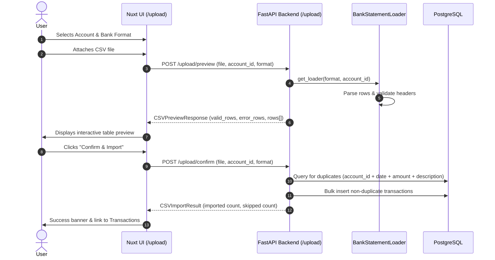

# Bank Statement CSV Import Guide

This guide explains how CSV statement parsing and ingestion work in the Personal Budget App, and how to add support for new bank export formats.

---

## 1. How It Works

The CSV import pipeline enables users to import bank transactions without linking a live bank connection via Plaid.



---

## 2. Currently Supported Formats

| Format Key | Bank / Card | Date Format | Sign Convention in Bank Export | App Normalization |
|---|---|---|---|---|
| `usaa` | USAA Checking & Savings | `%Y-%m-%d` (e.g. `2026-05-24`) | Negative for purchases; Positive for deposits | **Inverted:** `-amount` so charges are positive |
| `discover` | Discover Credit Card | `%m/%d/%Y` (e.g. `05/24/2026`) | Positive for charges; Negative for credits | **Preserved:** `amount` matches app convention |

---

## 3. Duplicate Detection Logic

To prevent importing the same transaction twice when uploading overlapping monthly statements, [`backend/routers/upload.py`](file:///Users/west/programming_stuff/budget_app/backend/routers/upload.py#L41-L56) checks for duplicates before inserting:

```python
def _is_duplicate(db: Session, txn: schemas.TransactionCreate) -> bool:
    existing = (
        db.query(models.Transaction)
        .filter(
            models.Transaction.account_id == txn.account_id,
            models.Transaction.date == txn.date,
            models.Transaction.amount == txn.amount,
            models.Transaction.description == txn.description,
        )
        .first()
    )
    return existing is not None
```

If an identical transaction is found:
- The row is skipped without raising an error.
- The `skipped` counter in `CSVImportResult` is incremented.

---

## 4. How to Add a New Bank Format

All statement loaders inherit from [`BankStatementLoader`](file:///Users/west/programming_stuff/budget_app/backend/bank_statement_loader.py#L13-L95). Follow these steps to support a new bank export:

### Step 1: Inspect the Bank's CSV Export
Examine the exported CSV header row and a few sample transaction rows. Determine:
1. Exact column names for date, description, amount, and status.
2. The date format string (e.g. `%m/%d/%Y` or `%Y-%m-%d`).
3. The amount sign convention (Are purchases positive or negative?).

### Step 2: Implement the Subclass in `backend/bank_statement_loader.py`
Add your new loader class:

```python
class ChaseCheckingLoader(BankStatementLoader):
    """
    Parses Chase checking/savings CSV exports.
    Expected columns: Details, Posting Date, Description, Amount, Type, Balance, Check or Slip #
    Chase exports charges as negative numbers.
    """

    column_map = {
        "Posting Date": "date",
        "Description": "description",
        "Amount": "amount",
        "Details": "status",
    }

    def transform_row(self, row: dict) -> Optional[TransactionCreate]:
        raw_amount = Decimal(row["amount"])
        # Chase exports charges as negative, deposits as positive.
        # Invert so charges become positive:
        app_amount = -raw_amount

        return TransactionCreate(
            account_id=self.account_id,
            date=datetime.strptime(row["date"], "%m/%d/%Y").date(),
            description=row["description"],
            amount=app_amount,
            pending=row["status"].lower() == "pending",
        )
```

### Step 3: Register in `LOADER_REGISTRY`
In [`backend/bank_statement_loader.py`](file:///Users/west/programming_stuff/budget_app/backend/bank_statement_loader.py#L162-L165):

```python
LOADER_REGISTRY: dict[str, type[BankStatementLoader]] = {
    "usaa": USAALoader,
    "discover": DiscoverLoader,
    "chase": ChaseCheckingLoader,  # <-- Added
}
```

### Step 4: Add Format Option to Frontend
In [`frontend/app/pages/upload.vue`](file:///Users/west/programming_stuff/budget_app/frontend/app/pages/upload.vue):
Add the new option to the format select dropdown:

```html
<option value="chase">Chase Checking / Savings</option>
```
