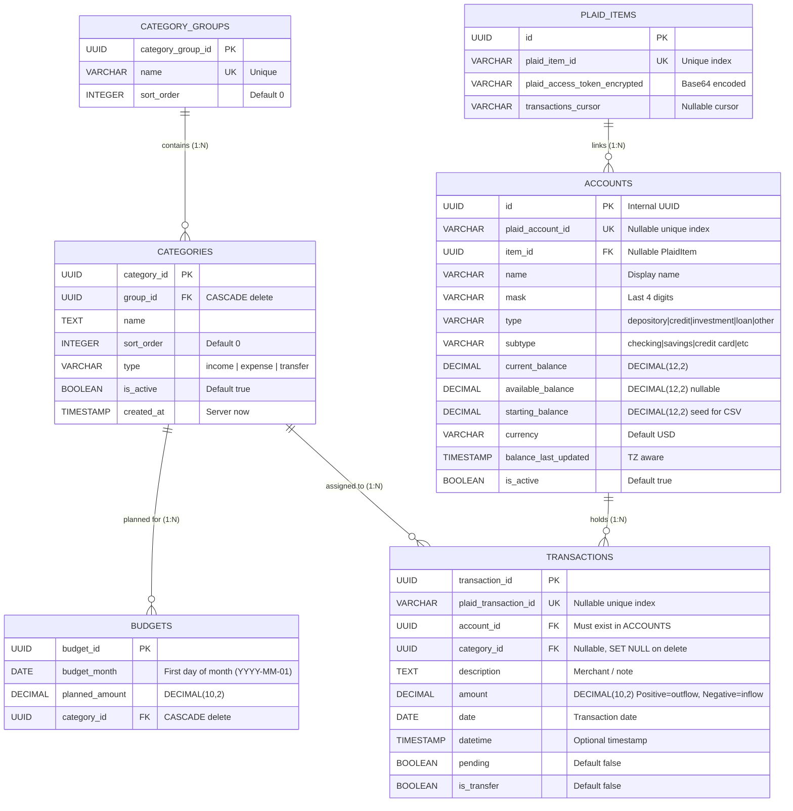

# Database Schema & Data Models

This document details the PostgreSQL schema, SQLAlchemy ORM models, relations, integrity constraints, and default seed data.

---

## 1. Entity-Relationship Diagram (ERD)



---

## 2. Table Definitions

### 2.1 `category_groups`
Represents top-level groupings such as "Housing", "Food", "Income", "Transportation".

| Column | Type | Nullable | Default | Description |
|---|---|---|---|---|
| `category_group_id` | UUID | No | `uuid.uuid4()` | Primary key |
| `name` | VARCHAR | No | - | Unique group name |
| `sort_order` | INTEGER | No | `0` | Order displayed in UI |

**Relationships:**
- `categories`: One-to-many relationship with `Category`. Deleting a group cascades (`cascade="all, delete-orphan"`).

---

### 2.2 `categories`
Individual sub-categories (e.g. "Groceries", "Rent/Mortgage", "Paycheck").

| Column | Type | Nullable | Default | Description |
|---|---|---|---|---|
| `category_id` | UUID | No | `uuid.uuid4()` | Primary key |
| `group_id` | UUID | No | - | Foreign key &rarr; `category_groups.category_group_id` |
| `name` | TEXT | No | - | Category display name |
| `sort_order` | INTEGER | No | `0` | Position inside parent group |
| `type` | VARCHAR | No | `'expense'` | `'income'`, `'expense'`, or `'transfer'` |
| `is_active` | BOOLEAN | No | `True` | Soft-disable flag |
| `created_at` | TIMESTAMP | No | `func.now()` | Creation timestamp |

**Constraints:**
- `uq_category_group_name`: `UNIQUE(group_id, name)` (Category names must be unique within their group).
- Foreign Key: `ON DELETE CASCADE` from `category_groups`.

**Relationships:**
- `group`: Back-populates `CategoryGroup.categories`.
- `budgets`: One-to-many with `Budget` (`cascade="all, delete-orphan"`).
- `transactions`: One-to-many with `Transaction`. Deleting a category sets `Transaction.category_id` to `NULL`.

---

### 2.3 `budgets`
Allocated monthly plan per category.

| Column | Type | Nullable | Default | Description |
|---|---|---|---|---|
| `budget_id` | UUID | No | `uuid.uuid4()` | Primary key |
| `budget_month` | DATE | No | - | Normalized to 1st of month (`YYYY-MM-01`) |
| `planned_amount` | DECIMAL(10,2) | No | - | Dollar amount planned for category |
| `category_id` | UUID | No | - | Foreign key &rarr; `categories.category_id` |

**Constraints:**
- `_budget_month_category_uc`: `UNIQUE(budget_month, category_id)` (A category can only have one plan per month).
- Foreign Key: `ON DELETE CASCADE` from `categories`.

---

### 2.4 `accounts`
Financial accounts (checking, savings, credit cards, manual accounts, Plaid-linked).

| Column | Type | Nullable | Default | Description |
|---|---|---|---|---|
| `id` | UUID | No | `uuid.uuid4()` | Primary key |
| `plaid_account_id` | VARCHAR | Yes | - | Plaid account identifier (unique index) |
| `item_id` | UUID | Yes | - | Foreign key &rarr; `plaid_items.id` |
| `name` | VARCHAR | No | - | Account name (e.g. "USAA Checking") |
| `mask` | VARCHAR | Yes | - | Last 4 digits (e.g. "4921") |
| `type` | VARCHAR | No | - | Standardized type: `depository`, `credit`, `investment`, `loan`, `other` |
| `subtype` | VARCHAR | Yes | - | Detailed subtype: `checking`, `savings`, `credit card`, `mortgage`, etc. |
| `current_balance` | DECIMAL(12,2) | No | `0.00` | Current balance |
| `available_balance` | DECIMAL(12,2) | Yes | - | Available balance (if reported by Plaid) |
| `starting_balance` | DECIMAL(12,2) | No | `0.00` | Baseline opening balance (used for manual accounts & credit cards) |
| `currency` | VARCHAR | No | `'USD'` | ISO currency code |
| `balance_last_updated` | TIMESTAMP(TZ) | Yes | - | Timestamp of last balance refresh |
| `is_active` | BOOLEAN | No | `True` | Active status flag |

---

### 2.5 `transactions`
Financial ledger records imported via Plaid or CSV.

| Column | Type | Nullable | Default | Description |
|---|---|---|---|---|
| `transaction_id` | UUID | No | `uuid.uuid4()` | Primary key |
| `plaid_transaction_id`| VARCHAR | Yes | - | Unique Plaid transaction identifier |
| `account_id` | UUID | No | - | Foreign key &rarr; `accounts.id` |
| `category_id` | UUID | Yes | - | Foreign key &rarr; `categories.category_id` (`ON DELETE SET NULL`) |
| `description` | TEXT | Yes | - | Merchant or transaction description |
| `amount` | DECIMAL(10,2) | No | - | **Positive = outflow / debit; Negative = inflow / credit** |
| `date` | DATE | No | - | Posted transaction date |
| `datetime` | TIMESTAMP(TZ) | Yes | - | Exact timestamp if provided |
| `pending` | BOOLEAN | No | `False` | True if transaction is still pending |
| `is_transfer` | BOOLEAN | No | `False` | True if marked as an inter-account transfer |

---

### 2.6 `plaid_items`
Represents an authorized bank connection via Plaid.

| Column | Type | Nullable | Default | Description |
|---|---|---|---|---|
| `id` | UUID | No | `uuid.uuid4()` | Internal UUID primary key |
| `plaid_item_id` | VARCHAR | No | - | Unique Plaid Item identifier |
| `plaid_access_token_encrypted` | VARCHAR | No | - | Encrypted access token |
| `transactions_cursor` | VARCHAR | Yes | - | Plaid sync cursor for incremental updates |

---

## 3. Precision & Decimal Handling

All monetary amounts in the backend and database use fixed-point decimals rather than floating-point numbers:
- `Budget.planned_amount`: `DECIMAL(10, 2)` (supports up to \$99,999,999.99)
- `Transaction.amount`: `DECIMAL(10, 2)`
- `Account.*_balance`: `DECIMAL(12, 2)` (supports up to \$9,999,999,999.99)
- Pydantic validation enforces `condecimal(max_digits=10, decimal_places=2)` to prevent floating-point rounding errors.

---

## 4. Default Seed Data

On startup, [`backend/main.py`](file:///Users/west/programming_stuff/budget_app/backend/main.py) calls `init_db(db)` in [`backend/initial_data.py`](file:///Users/west/programming_stuff/budget_app/backend/initial_data.py). If they do not already exist, the following baseline categories are created:

1. **Income** (`sort_order: 0`)
   - `Paycheck` (`income`, `0`)
   - `Bonus` (`income`, `1`)
   - `Interest` (`income`, `2`)
2. **Saving** (`sort_order: 0`)
   - `House Fund` (`expense`, `0`)
3. **Housing** (`sort_order: 1`)
   - `Rent/Mortgage` (`expense`, `0`)
   - `Utilities` (`expense`, `1`)
   - `Maintenance` (`expense`, `2`)
4. **Food** (`sort_order: 2`)
   - `Groceries` (`expense`, `0`)
   - `Restaurants` (`expense`, `1`)
5. **Transportation** (`sort_order: 3`)
   - `Fuel` (`expense`, `0`)
   - `Public Transit` (`expense`, `1`)
   - `Service/Parts` (`expense`, `2`)

---

## 5. Schema Migrations Strategy

Tables are currently provisioned automatically on startup via:
```python
models.Base.metadata.create_all(bind=engine)
```
When modifying models in [`backend/models.py`](file:///Users/west/programming_stuff/budget_app/backend/models.py):
- New tables are automatically created on the next startup.
- Column modifications on existing tables require either manual `ALTER TABLE` execution via `psql` or an Alembic migration setup.
