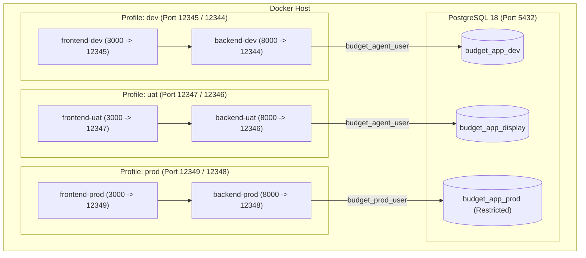
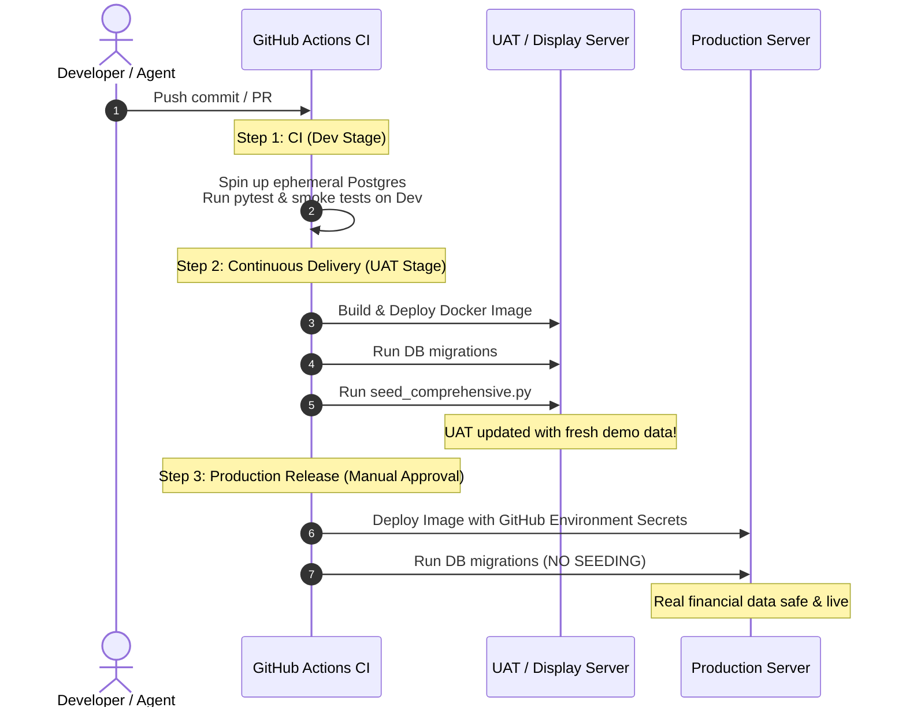

# 3-Tier Environment Architecture & CI/CD Roadmap: Dev, UAT (Display), and Prod

## 1. Executive Summary

This plan outlines the architecture, security isolation, and implementation roadmap to split the Budget App into three distinct, concurrent environments:

1. **`dev` (Development & Agent Sandbox)**: Daily coding, unit testing, and code agent experimentation. Contains disposable test data.
2. **`uat` / `display` (User Acceptance Testing & Family Showcase)**: Polished, realistic demo environment with fully assigned budgets ($0 to be assigned), realistic accounts, payees, and transactions. Always ready to show friends and family without exposing private data.
3. **`prod` (Personal Production)**: Real bank connections, real transactions, and authentic budgets. Strictly locked down with technical permission barriers preventing code agents and local test runners from connecting.

This layout directly mirrors enterprise CI/CD pipelines (**Dev → UAT/Staging → Prod**), ensuring that when GitHub Actions or cloud deployments are introduced, zero architectural refactoring is required.

---

## 2. Environment Matrix

| Dimension | `dev` (Development) | `uat` (Display / Staging) | `prod` (Production) |
| :--- | :--- | :--- | :--- |
| **CI/CD Role** | Pull Request builds & agent work | Pre-release verification & demos | Live personal budget |
| **Database Name** | `budget_app_dev` | `budget_app_display` | `budget_app_prod` |
| **PostgreSQL User** | `budget_agent_user` | `budget_agent_user` | `budget_prod_user` |
| **Database Permissions** | Full CRUD on `budget_app_dev` | Full CRUD on `budget_app_display` | Full CRUD on `budget_app_prod` only |
| **Code Agent Access** | **Allowed** | **Allowed** (for seeder tooling) | **STRICTLY BLOCKED** |
| **Frontend Port** | `12345` (default) | `12347` | `12349` (on demand) |
| **Backend API Port** | `12344` (default) | `12346` | `12348` (on demand) |
| **Env File Location** | `.env.dev` (in workspace) | `.env.uat` (in workspace) | `~/.config/budget_app/prod.env` (outside repo) |
| **Data Nature** | Disposable test rows | Curated realistic dummy data | Real financial data |
| **Seed Strategy** | Wiped/seeded by tests | Auto-seeded with showcase data | **Never seeded** (schema migrations only) |

---

## 3. Security Architecture: Isolating Code Agents from `prod`

Because AI coding agents have workspace filesystem access and shell execution capabilities, isolating `prod` requires **defense-in-depth** across three independent layers:

```
[ Code Agent / Developer ]
          │
          ├── Layer 1: Filesystem Boundary
          │   ├── Workspace .env points to Dev
          │   └── Prod secrets stored outside repo (~/.config/budget_app/prod.env)
          │
          ├── Layer 2: PostgreSQL Permission Barrier (Hard Kernel)
          │   ├── Agent DB Role: 'budget_agent_user'
          │   ├── REVOKE CONNECT ON DATABASE budget_app_prod FROM budget_agent_user;
          │   └── Only 'budget_prod_user' can authenticate to prod
          │
          └── Layer 3: Contractual & Tooling Guardrails
              ├── AGENTS.md rules explicitly forbidding prod targeting
              └── Tests and scripts hardcoded to fail if TARGET_ENV == "prod"
```

### Layer 1: PostgreSQL Role-Based Access Control (RBAC)
PostgreSQL enforces the ultimate security boundary. Even if a code agent executes raw SQL or bash commands, PostgreSQL will reject any connection attempt to `prod`:

```sql
-- 1. Create databases
CREATE DATABASE budget_app_dev;
CREATE DATABASE budget_app_display;
CREATE DATABASE budget_app_prod;

-- 2. Create the Agent / Dev user (used in repository)
CREATE USER budget_agent_user WITH PASSWORD 'dev_secret_local';
GRANT ALL PRIVILEGES ON DATABASE budget_app_dev TO budget_agent_user;
GRANT ALL PRIVILEGES ON DATABASE budget_app_display TO budget_agent_user;

-- Explicitly revoke connect permission to prod
REVOKE CONNECT ON DATABASE budget_app_prod FROM PUBLIC;
REVOKE CONNECT ON DATABASE budget_app_prod FROM budget_agent_user;

-- 3. Create the Production user (credentials never stored in workspace)
CREATE USER budget_prod_user WITH PASSWORD '<STRONG_PERSONAL_PASSWORD>';
GRANT ALL PRIVILEGES ON DATABASE budget_app_prod TO budget_prod_user;
```

### Layer 2: Out-of-Workspace Secrets Management
- The default `.env` in the repository will point to `budget_app_dev`.
- `.env.uat` will reside in the repository pointing to `budget_app_display`.
- Production credentials (`prod.env`) will be located in the user's home directory: `~/.config/budget_app/prod.env`.
- Code agents operating within `/Users/west/programming_stuff/budget_app` will have no access to production credentials.

### Layer 3: Agent Guardrails in `AGENTS.md`
The repository's [`AGENTS.md`](file:///Users/west/programming_stuff/budget_app/AGENTS.md) will be updated with an explicit invariant:
- All automated tests, seeder runs, and migrations must target `budget_app_dev` or `budget_app_display`.
- Agents must never inspect, modify, or launch processes using `~/.config/budget_app/prod.env`.

---

## 4. Docker Architecture & Port Layout

The container environment will use **Docker Compose Profiles** to allow running individual environments or all three simultaneously on distinct ports.



### Docker Compose Service Definitions

- **PostgreSQL (`db`)**: Single database engine hosting all three logical databases with separate user roles.
- **`dev` Profile**:
  - `backend-dev`: `POSTGRES_DB=budget_app_dev`, port `12344:8000`
  - `frontend-dev`: proxies to `backend-dev`, port `12345:3000`
- **`uat` Profile**:
  - `backend-uat`: `POSTGRES_DB=budget_app_display`, port `12346:8000`
  - `frontend-uat`: proxies to `backend-uat`, port `12347:3000`
- **`prod` Profile**:
  - `backend-prod`: `POSTGRES_DB=budget_app_prod`, port `12348:8000` (reads env from `~/.config/budget_app/prod.env`)
  - `frontend-prod`: proxies to `backend-prod`, port `12349:3000`

---

## 5. Curated Display (UAT) Data Strategy

The `display` database will be populated by an enhanced version of [`tests/seed_comprehensive.py`](file:///Users/west/programming_stuff/budget_app/tests/seed_comprehensive.py). When you open `http://localhost:12347` to show family or friends, it will show a pristine, fully populated personal budget:

### Features of the Showcase Dataset
1. **Accounts**:
   - Primary Checking ($3,540.25)
   - High-Yield Savings ($14,250.00)
   - Chase Sapphire Credit Card (-$1,120.45 balance)
   - Vanguard Brokerage ($32,500.00)
2. **Zero-Based Budget Allocations**:
   - All income for the current month planned down to the cent: **`to_be_assigned == $0.00`** (Green banner displayed).
   - Past 3 months populated with realistic variance and historical spending trends.
3. **Realistic Payees & Multi-Month Transactions**:
   - Grocery stores (Trader Joe's, Costco, Whole Foods).
   - Subscriptions (Netflix, Spotify, Apple iCloud).
   - Recurring utility bills (Electric, Internet, Water) and paycheck direct deposits.
4. **Clean Reset Command**:
   - A single command resets the display environment whenever needed:
     ```bash
     ./manage.sh seed-display
     ```

---

## 6. Path to CI/CD Automation

This structure sets up the repository for an automated GitHub Actions CI/CD pipeline:



### Key CI/CD Architectural Benefits
- **One Artifact, Multiple Environments**: The exact same Docker image built in CI is promoted to UAT and Prod.
- **Zero Risk of Accidental Seeding in Prod**: The CI/CD pipeline script explicitly binds seed operations to UAT only.
- **Environment Secrets**: Prod secrets are kept in GitHub's protected "Production" environment requiring manual approval before deployment.

---

## 7. Phased Implementation Plan

### Phase 1: Database Creation & RBAC Hardening
- [ ] Inspect existing `budget_app-db-1` container.
- [ ] Backup current `budget_app_data` to ensure no existing user transactions are lost.
- [ ] Create `budget_app_dev`, `budget_app_display`, and `budget_app_prod` (or rename existing `budget_app_data` to `budget_app_prod`).
- [ ] Create `budget_agent_user` and `budget_prod_user`.
- [ ] Apply `REVOKE CONNECT` on `budget_app_prod` for `budget_agent_user`.

### Phase 2: Configuration & Docker Profiles
- [ ] Create `.env.dev` and `.env.uat` in the repository root.
- [ ] Create template `~/.config/budget_app/prod.env` for the user's private configuration.
- [ ] Update `docker-compose.yml` to define services for `dev`, `uat`, and `prod` with profile tags.
- [ ] Verify port mapping (`12344/12345` for dev, `12346/12347` for uat, `12348/12349` for prod).

### Phase 3: Display Dataset Polish & Reset Automation
- [ ] Review [`tests/seed_comprehensive.py`](file:///Users/west/programming_stuff/budget_app/tests/seed_comprehensive.py) to ensure current-month zero-based budgeting matches `$0.00` to-be-assigned.
- [ ] Verify credit card transfer matches and recurring items detection in the seeder.
- [ ] Add CLI flag `--target-env [dev|display]` and safety assertion preventing seeding on `prod`.

### Phase 4: Local Management CLI (`manage.sh`)
- [ ] Create a lightweight convenience helper `./manage.sh`:
  - `./manage.sh start dev` — starts dev containers
  - `./manage.sh start uat` — starts uat/display containers
  - `./manage.sh start prod` — starts prod containers using out-of-repo env
  - `./manage.sh seed-display` — resets uat database to clean showcase data
  - `./manage.sh status` — shows running environments and ports

### Phase 5: Documentation & Agent Rules
- [ ] Update [`AGENTS.md`](file:///Users/west/programming_stuff/budget_app/AGENTS.md) with strict isolation constraints (agents must only use dev).
- [ ] Update [`README.md`](file:///Users/west/programming_stuff/budget_app/README.md) with quickstart instructions for all three environments.

---

## 8. Verification Plan

1. **Agent Lockout Verification**:
   - Run a test connection using `budget_agent_user` credentials against `budget_app_prod`.
   - Confirm PostgreSQL explicitly terminates the connection with `FATAL: permission denied for database "budget_app_prod"`.
2. **Display Verification**:
   - Start UAT container: `docker compose --profile uat up -d`.
   - Open `http://localhost:12347` in browser.
   - Confirm all accounts, green budget balances, and transactions display cleanly without error.
3. **Dev Verification**:
   - Run existing smoke test: `python3 tests/smoke_test.py`.
   - Confirm it hits `http://localhost:12344` (`budget_app_dev`) with zero impact on UAT or Prod.
