# Volatility Map & Decomposition Strategy

## 1. Overview & Core Principles

Rather than organizing the codebase mechanically around functional entities ("budgets", "categories", "transactions") or layering every endpoint identically, this architecture decomposes the system along **observed, independent axes of volatility**.

### Architectural Invariants:
1. **Volatility-Driven Boundaries:** Components exist only to protect against demonstrated, independent reasons to change.
2. **Workflow Managers:** A Manager is justified strictly when there is meaningful orchestration or sequencing across multiple activities.
3. **Calculation Engines:** An Engine is justified strictly when there is an independently volatile business algorithm, heuristic, or calculation rule that can be expressed as a pure, infrastructure-free function.
4. **ResourceAccess / Accessors:** Accessors own concrete interaction with PostgreSQL tables or external APIs (querying, filtering, eager loading, persistence). They replace generic repository patterns.
5. **No Mechanical Layering:** Simple CRUD operations do **not** receive Managers or Engines. They follow a direct `Router -> Accessor` design.
6. **No Domain-Noun Architecture:** Domain entities (Account, Category, Budget, Transaction) do not automatically become architecture layers (`AccountManager`, `CategoryEngine`, etc.).

---

## 2. Volatility Analysis Matrix

The following matrix documents only **observed volatility** and **confirmed roadmap items**.

| System Responsibility | What Changes Independently? | Volatility Rate | Observed Evidence in Codebase | Justified Architecture Boundary |
|---|---|:---:|---|---|
| **Bank Statement Parsing** | Bank export headers, date formats, transaction sign conventions | **Medium-High** | USAA and Discover CSV formats have opposite sign conventions and different column headers | **Ingestion Parser / StatementLoader** (`backend/bank_statement_loader.py`) |
| **Plaid API Integration** | External API endpoints, cursor-based sync protocol, credential decryption | **High** | Plaid API cursor typing quirk requiring raw HTTP requests; token storage security | **External ResourceAccess** (`plaid_access` / SDK client) |
| **Zero-Based Budget (ZBB) Math** | Sign inversions, category remaining, group totals, `to_be_assigned` | **Medium** | Financial math was previously copy-pasted across `get_budget_summary` and `get_dashboard_summary` | **Pure Domain Engine** (`backend/domain/budgeting.py`) |
| **Transfer Reconciliation Matching** | Pairing heuristics: exact absolute amount, opposing signs, different accounts, $\le 2$ days | **Medium-High** | Heuristic matching was trapped inside `routers/credit_cards.py` | **Pure Domain Engine** (`backend/domain/reconciliation.py`) |
| **Credit Card Financial Metrics** | Calculating starting balance, `balance_owed`, monthly charges, monthly payments | **Medium** | Card balance calculations were trapped inside route handlers | **Pure Domain Engine** (`backend/domain/credit_cards.py`) |
| **Budget Summary Orchestration** | Sequencing period determination, category fetching, budget allocations, actuals aggregation | **Medium** | Coordinates 3 accessors and the Budget Engine | **Workflow Manager** (`backend/managers/budget_summary_manager.py`) |
| **Dashboard Summary Orchestration** | Composing budget health, active account balances snapshot, and 10 recent transactions | **Medium** | Assembles 3 disparate data concerns into a unified view | **Workflow Manager** (`backend/managers/dashboard_summary_manager.py`) |
| **Relational Data Persistence** | SQLAlchemy query syntax, eager loading, session transactions | **Low-Medium** | Raw SQL queries scattered across route handlers | **Concrete ResourceAccess / Accessors** (`backend/access/`) |
| **API Transport & Validation** | FastAPI path/query parsing, HTTP status codes, Pydantic response models | **Medium** | Route parameter validation and response serialization | **Presentation / Router Layer** (`backend/routers/`) |
| **Client UI Views** | Visual layout, component hierarchy, responsive styling | **High** | Frontend views in Nuxt 4 / Vue 3 SPA | **Client Presentation Layer** (`frontend/app/pages/`) |

---

## 3. Explicitly Rejected & Speculative Drivers

The following items are **speculative** and must **not** be used to justify architectural layers, interfaces, or configuration parameters:

| Speculative Concept | Why Rejected as an Architectural Driver |
|---|---|
| **Alternative Bank Aggregators (MX, Teller)** | The application currently integrates exclusively with Plaid. Introducing an `IBankProvider` interface is premature generalization. |
| **Hypothetical CSV Layouts (Chase, BoA, OFX/QIF)** | Only USAA and Discover statements are currently supported. Adding generic bank format parsers before real formats are needed adds dead code. |
| **Fuzzy Duplicate Matching / Hash Deduplication** | Current deduplication is an exact 4-tuple match `(account_id, date, amount, description)`. Algorithmic scoring engines are overengineering. |
| **Merchant-Keyword / Split-Transfer Matching** | Inter-account transfers currently use deterministic 1-to-1 pairing within 2 days. Heuristic pipeline frameworks are rejected. |
| **Statement Cycles, APR Tracking, Minimum Payments** | Credit card accounting strictly tracks all-time net transactions and monthly charges/payments. Liability forecasting engines are speculative. |
| **Nested Subcategories / Icon / Color Metadata** | Categories form a flat 2-level hierarchy (`CategoryGroup -> Category`). Tree structures and metadata engines are rejected. |
| **Multi-Currency Ledgers / Forex Rates** | All accounts and calculations strictly operate in fixed-point USD decimals. Currency conversion engines are speculative. |
| **Custom / Bi-Weekly Budget Periods** | Zero-based budgeting operates on standard calendar months. Configurable calendar engines are rejected. |
| **Multi-User / JWT Authentication Infrastructure** | The system currently operates as a personal budget application without multi-tenant authentication boundaries. |
| **Alternative Persistence Engines (MongoDB, DynamoDB)** | The application fundamentally relies on relational guarantees, foreign keys, and ACID transactions. Database abstraction layers are rejected. |

---

## 4. System Architecture & Component Interactions

```mermaid
flowchart TD
    subgraph Presentation ["Presentation Layer (FastAPI Routers)"]
        RouterSummary["summaries.py<br/>(/summary/budget, /summary/dashboard)"]
        RouterCC["credit_cards.py<br/>(/credit-cards/summary, candidates)"]
        RouterCRUD["accounts.py, categories.py, budgets.py<br/>(Entity CRUD)"]
        RouterUpload["upload.py<br/>(/upload/preview, /upload/confirm)"]
        RouterPlaid["plaid.py<br/>(/plaid/sync_accounts, sync_transactions)"]
    end

    subgraph Managers ["Workflow Managers (Sequencing Volatility)"]
        BudgetSummaryMgr["BudgetSummaryManager<br/>(Reference Vertical Slice)"]
        DashSummaryMgr["DashboardSummaryManager<br/>(Slice 2 Implemented & Verified)"]
        CCSummaryMgr["CreditCardSummaryManager<br/>(Slice 3 Implemented & Verified)"]
        ReconcileMgr["TransferReconciliationManager<br/>(Planned)"]
        CSVImportMgr["CSVImportManager<br/>(Planned)"]
        PlaidSyncMgr["PlaidSyncManager<br/>(Planned)"]
    end

    subgraph Engines ["Domain Calculation Engines (Pure Business Rules)"]
        ZBBEngine["Budget Engine<br/>(calculate_budget_summary)"]
        CCEngine["Credit Card Engine<br/>(calculate_credit_card_state)"]
        ReconcileEngine["Reconciliation Engine<br/>(detect_transfer_candidates)"]
    end

    subgraph Accessors ["ResourceAccess (Concrete Persistence & API Access)"]
        BudgetAcc["budget_access.py"]
        CatAcc["category_access.py"]
        TxAcc["transaction_access.py"]
        AcctAcc["account_access.py"]
        PlaidAcc["plaid_access / SDK Client"]
        CSVLoader["bank_statement_loader.py (USAA, Discover)"]
    end

    subgraph Resources ["External & Storage Resources"]
        DB[(PostgreSQL)]
        PlaidAPI["Plaid API"]
        CSVFile["CSV Upload Stream"]
    end

    %% Router to Manager
    RouterSummary --> BudgetSummaryMgr
    RouterSummary --> DashSummaryMgr
    RouterCC --> CCSummaryMgr
    RouterCC --> ReconcileMgr
    RouterUpload --> CSVImportMgr
    RouterPlaid --> PlaidSyncMgr

    %% Simple CRUD bypasses Managers directly to Accessors
    RouterCRUD --> AcctAcc
    RouterCRUD --> CatAcc
    RouterCRUD --> BudgetAcc
    RouterCRUD --> TxAcc

    %% Manager internal wiring
    BudgetSummaryMgr --> ZBBEngine
    BudgetSummaryMgr --> CatAcc
    BudgetSummaryMgr --> BudgetAcc
    BudgetSummaryMgr --> TxAcc

    DashSummaryMgr --> BudgetSummaryMgr
    DashSummaryMgr --> AcctAcc
    DashSummaryMgr --> TxAcc

    CCSummaryMgr --> CCEngine
    CCSummaryMgr --> AcctAcc
    CCSummaryMgr --> TxAcc

    ReconcileMgr --> ReconcileEngine
    ReconcileMgr --> TxAcc

    CSVImportMgr --> CSVLoader
    CSVImportMgr --> AcctAcc
    CSVImportMgr --> TxAcc

    PlaidSyncMgr --> PlaidAcc
    PlaidSyncMgr --> AcctAcc
    PlaidSyncMgr --> TxAcc

    %% Accessors to Resources
    BudgetAcc --> DB
    CatAcc --> DB
    TxAcc --> DB
    AcctAcc --> DB
    PlaidAcc --> PlaidAPI
    CSVLoader --> CSVFile
```

### Key Structural Invariants:
1. **Not Every Endpoint Uses Every Layer:** Direct `Router -> Accessor` is the standard, terminal pattern for CRUD.
2. **Direct Manager Composition:** `DashboardSummaryManager` reuses `BudgetSummaryManager` directly to obtain zero-based budget metrics, eliminating calculation and query duplication.
3. **Engines Remain Pure:** Calculation Engines have zero dependencies on SQLAlchemy, FastAPI, or Pydantic.
4. **Accessors Own Query Mechanics:** Accessors encapsulate filtering, ordering, and eager loading, preventing lazy-loading bugs.

---

## 5. Ingestion Architecture: CSV vs. Plaid Disentanglement

Although both ingestion pipelines persist transactions to PostgreSQL, their operational characteristics and volatility axes are fundamentally different. They must **not** be unified into a generic transaction ingestion framework.

### 5.1. CSV Statement Ingestion Pipeline
- **Input Resource:** Stateless file stream (`UploadFile`).
- **Processing Model:** Batch parsing via `BankStatementLoader` hierarchy (USAA, Discover).
- **Identity Model:** No stable external transaction IDs.
- **Deduplication Policy:** Exact 4-field tuple match `(account_id, date, amount, description)`.
- **Event Lifecycle:** Two-phase (Preview $\rightarrow$ Confirm). Insert-only; duplicate rows are skipped; no deletion or modification events.
- **Error Model:** Captures row-level parse errors gracefully without failing the entire file preview.

### 5.2. Plaid Synchronization Pipeline
- **Input Resource:** External Plaid REST API.
- **Processing Model:** Stateful cursor-based pagination loop (`/transactions/sync`).
- **Identity Model:** Exact, stable external IDs (`plaid_transaction_id`).
- **Deduplication Policy:** Upsert on primary key / external ID match.
- **Event Lifecycle:** Continuous state synchronization. Supports additions, modifications, and removals.
- **Security Dependency:** Decrypts encrypted access tokens from `PlaidItem` storage before making external API requests.

---

## 6. Anti-Patterns & Overengineering to Avoid

1. **Generic Repository Interfaces (`IRepository<T>`):**
   Introducing generic repository abstractions, specification patterns, or Unit of Work frameworks for PostgreSQL is unnecessary boilerplate. Concrete Python functions in focused access modules (`account_access.py`, `transaction_access.py`) are preferred.
2. **Manager-per-Domain-Entity Antipattern:**
   Creating `AccountManager`, `CategoryManager`, or `BudgetManager` for basic CRUD operations adds zero architectural value. A Manager is justified strictly by workflow sequencing.
3. **Engine-per-Feature Antipattern:**
   Inventing pseudo-engines (e.g. `DashboardEngine`, `TransferConfirmationEngine`, `ReorderingEngine`) for simple sums, index increments, or boolean updates is overengineering.
4. **DTO Layer Proliferation:**
   Do not introduce parallel DTO types for every layer. Accessors return ORM persistence records to Managers; Managers map records into clean, immutable application dataclasses; Routers serialize application dataclasses to Pydantic responses.
5. **Microservices / Distributed Message Brokers:**
   Deploying Kafka, RabbitMQ, or Celery for a personal budgeting application would introduce substantial operational overhead without benefit.

---

## 7. Remaining Workflows Classification & Architectural Decisions

Following the reference vertical slice (Budget Summary) and the completed Dashboard Summary slice, the remaining application workflows are classified based on observed volatility:

### 7.1. Classification Summary Matrix

| Workflow | Manager? | Engine? | Accessor? | Target Pattern | Rationale |
|---|:---:|:---:|:---:|---|---|
| **Dashboard Summary** | **Yes** | **Reuse Budget Engine** | **Yes** | `Router -> Manager -> (BudgetSummaryManager + Accessors)` | Composes existing Budget Summary workflow, active accounts, and 10 recent transactions (Slice 2 Implemented & Verified; see [dashboard-summary.md](dashboard-summary.md)). |
| **Credit-Card Summary** | **Yes** | **Reuse CC Engine** | **Yes** | `Router -> Manager -> (CreditCardEngine + Accessors)` | Coordinates active credit accounts, historical ledger queries, calculation engine execution, and monthly display selection (Slice 3 Implemented & Verified; see [credit-card-summary.md](credit-card-summary.md)). |
| **Transfer Candidate Search** | **Yes** | **Reuse Reconciliation Engine** | **Yes** | `Router -> Manager -> (ReconciliationEngine + Accessor)` | Coordinates querying unmatched inflows/outflows, invoking matching heuristics, and linking account details. |
| **CSV Import & Deduplication** | **Yes** | **No Standalone Engine** | **Yes** | `Router -> Manager -> Accessors` | Coordinates account verification, loader parsing, exact duplicate checking, batch insert, and commit. |
| **Plaid Account Sync** | **Yes** | **No Engine** | **Yes** | `Router -> Manager -> (PlaidAccessor + AccountAccess)` | External API call, credential decryption, and account/balance persistence. |
| **Plaid Transaction Sync** | **Yes** | **No Engine** | **Yes** | `Router -> Manager -> (PlaidAccessor + TransactionAccess)` | Stateful cursor pagination loop, sign normalization, upsert/deletion mapping, cursor persistence. |
| **Transfer Confirmation** | **No** | **No Engine** | **Yes** | `Router -> Accessor` | Single atomic boolean mutation (`is_transfer = True`). |
| **Manual Transaction CRUD** | **No** | **No Engine** | **Yes** | `Router -> Accessor` | Standard entity CRUD and query filtering. |
| **Account CRUD** | **No** | **No Engine** | **Yes** | `Router -> Accessor` | Standard entity CRUD. Moving raw SQL queries to `account_access.py`. |
| **Category & Group CRUD** | **No** | **No Engine** | **Yes** | `Router -> Accessor` | Standard entity CRUD (already in `crud/category.py`). |
| **Category & Group Reorder** | **No** | **No Engine** | **Yes** | `Router -> Accessor` | Batch updates of sequential integer `sort_order`. |
| **Budget Allocation CRUD** | **No** | **No Engine** | **Yes** | `Router -> Accessor` | Standard monthly allocation entity CRUD. |
| **Plaid Link-Token Creation** | **No** | **No Engine** | **Yes** | `Router -> Plaid Accessor` | Single external SDK call. |

### 7.2. Category 1: Manager + Existing Engine
- **Credit-Card Summary (Slice 3 Implemented & Verified):** Uses `CreditCardSummaryManager` orchestrating active credit accounts, historical transactions, calculation engine execution, and monthly display selection, reusing the existing, pure [`calculate_credit_card_state`](backend/domain/credit_cards.py). Documented in [credit-card-summary.md](credit-card-summary.md).

- **Transfer Candidate Search:** Will use a `TransferReconciliationManager` orchestrating unmatched inflow/outflow queries and account metadata, reusing the existing, pure [`detect_transfer_candidates`](backend/domain/reconciliation.py).

### 7.3. Category 2: Manager Likely Justified, No Engine
- **CSV Confirmation & Deduplication:** Multi-step pipeline (verify account $\rightarrow$ parse statement $\rightarrow$ deduplicate $\rightarrow$ batch insert $\rightarrow$ commit). The 4-field tuple deduplication rule is kept concrete in the access/manager boundary; an abstract engine is rejected.
- **Plaid Account & Transaction Sync:** Complex external cursor pagination, credential decryption, and transactional state synchronization. No financial algorithms or business decisions exist; an engine is rejected.

### 7.4. Category 3: No Manager and No Engine Currently Justified
Direct **`Router -> Accessor`** is the terminal and correct VBD design for:
- Transfer confirmation (`POST /credit-cards/mark-transfers`)
- Manual transaction CRUD (`backend/routers/transactions.py`)
- Account CRUD (`backend/routers/accounts.py`)
- Category and CategoryGroup CRUD (`backend/routers/categories.py`)
- Category and CategoryGroup reordering (`/category-groups/reorder`, `/categories/reorder`)
- Budget allocation CRUD (`backend/routers/budgets.py`)
- Plaid link-token creation (`POST /plaid/create_link_token`)

> [!IMPORTANT]
> **Deliberate VBD Architecture:**
> The absence of a Manager or Engine for simple workflows is an intentional VBD decision, not incomplete architecture. Introducing Managers or Engines into these simple CRUD workflows would represent functional decomposition masquerading as VBD and create meaningless passthrough boilerplate.

---

## 8. Preserved Exclusions & Unresolved Domain Items

The following items remain intentionally excluded from structural refactoring and must not be modified silently:
1. `Transaction.description` database/schema nullability mismatch (Known Defect).
2. Category-group cascade deletion backend inconsistency (Known Defect).
3. Credit-card transfer inclusion in `balance_owed` vs exclusion from `charges_this_month` (Unresolved Domain Decision).
4. Credit-card inclusion of future-dated transactions in current `balance_owed` (Unresolved Domain Decision).
5. Transfer-matching greedy / insertion-order dependency without closest-date tie-breaking (Unresolved Domain Decision).
6. Plaid token base64 storage upgrade to real cryptographic encryption (Security Migration).
