# Volatility Map & Decomposition Strategy

## 1. Overview & Core Principles

Rather than organizing the codebase mechanically around functional entities ("budgets", "categories", "transactions") or layering every endpoint identically, this architecture decomposes the system along **observed, independent axes of volatility**.

### Architectural Invariants:
1. **Volatility-Driven Boundaries:** Components exist only to protect against demonstrated, independent reasons to change.
2. **Workflow Managers:** A Manager is justified strictly when there is meaningful orchestration or sequencing across multiple activities.
3. **Calculation Engines & Policies:** An Engine is justified strictly when there is an independently volatile business algorithm, heuristic, calculation rule, or domain invariant that can be expressed as a pure, infrastructure-free module. Simple supporting formulas, narrow canonical formatting helpers, and date utilities are pure domain utilities, not architectural Engines.
4. **ResourceAccess / Accessors:** Accessors own concrete interaction with PostgreSQL tables, filesystem models, or external network APIs (querying, filtering, eager loading, persistence). They replace generic repository patterns.
5. **Ingestion & Parser Boundary:** `BankStatementLoader` and format auto-detection adapt messy external bank CSV statement streams into normalized domain records (`TransactionCreate`). Statement parsing is **not** ResourceAccess and **not** a business Engine.
6. **No Mechanical Layering:** Simple CRUD operations do **not** receive Managers or Engines. They follow a direct `Router -> Accessor` design.
7. **No Domain-Noun Architecture:** Domain entities (Account, Category, Budget, Transaction) do not automatically become architecture layers (`AccountManager`, `CategoryEngine`, etc.).

---

## 2. Volatility Analysis Matrix

The following matrix documents only **observed volatility** and **confirmed roadmap items**.

| System Responsibility | What Changes Independently? | Volatility Rate | Observed Evidence in Codebase | Justified Architecture Boundary |
|---|---|:---:|---|---|
| **Bank Statement Parsing** | Bank export headers, date formats, transaction sign conventions | **Medium-High** | USAA and Discover CSV formats have opposite sign conventions and different column headers | **Ingestion Parser / StatementLoader** (`backend/bank_statement_loader.py`: `BankStatementLoader`, `USAALoader`, `DiscoverLoader`, `MappedStatementLoader`) |
| **CSV Custom Format Configuration** | User-defined column mappings, date formats, sign conventions, and status tokens | **Low-Medium** | Bank statement variations across user institutions without codebase changes | **Configuration Resource (`models.CSVFormat`) & ResourceAccess** (`backend/access/csv_format_access.py`) |
| **CSV Format Header Auto-Detection** | Header matching against built-in and user-defined candidate formats | **Medium** | Upload-first workflow automatically resolving formats from CSV header structure | **Ingestion Format Detection Function** (`backend/bank_statement_loader.py:detect_csv_format`) |
| **Plaid API Integration** | External API endpoints, cursor-based sync protocol, credential decryption | **High** | Plaid API cursor typing quirk requiring raw HTTP requests; token storage security | **External ResourceAccess** (`plaid_access.py` / SDK client for `/accounts/get` + `plaid_transaction_access.py` / raw HTTP for `/transactions/sync`) |
| **Zero-Based Budget (ZBB) Math** | Sign inversions, category remaining, group totals, `to_be_assigned` | **Medium** | Financial math was previously copy-pasted across `get_budget_summary` and `get_dashboard_summary` | **Pure Domain Calculation Engine** (`backend/domain/budgeting.py`) |
| **Transfer Reconciliation Matching** | Pairing heuristics: exact absolute amount, opposing signs, different accounts, $\le 2$ days | **Medium-High** | Heuristic matching was trapped inside `routers/credit_cards.py` | **Pure Domain Calculation Engine** (`backend/domain/reconciliation.py`) |
| **Credit Card Financial Metrics** | Calculating starting balance, `balance_owed`, monthly charges, monthly payments | **Medium** | Card balance calculations were trapped inside route handlers | **Pure Domain Calculation Engine** (`backend/domain/credit_cards.py`) |
| **ML Category Suggestions** | Feature extraction, TF-IDF n-grams, Logistic Regression classification, operating threshold, quality gates | **High** | Local machine learning training, inference, and candidate model evaluation change independently of API schemas | **Pure Domain Calculation Engine** (`backend/domain/ml_categorization.py`), **Workflow Manager** (`backend/managers/ml_categorization_manager.py`), & **Model Accessor** (`backend/access/ml_model_access.py`) |
| **Recurring Transaction Detection** | Cadence clustering (weekly, biweekly, monthly, annual), interval validation, amount stability filtering, projection | **Medium-High** | Heuristic detection across historical posted transactions | **Pure Domain Calculation Engine** (`backend/domain/recurring_transactions.py`), **Workflow Manager** (`backend/managers/recurring_transaction_manager.py`), & **ResourceAccess** (`backend/access/recurring_access.py`) |
| **Depository Ledger Balance** | Calculating cash balance from ledger transactions and setup starting balance | **Low-Medium** | Simple subtraction formula ($starting\_balance - net\_transactions$) | **Pure Domain Utility Function** (`backend/domain/accounts.py`) |
| **Account Reconciliation Math** | Calculating cleared balances, checking statement balance agreement, locking reconciled transactions | **Medium** | Financial reconciliation calculations (cleared balance, statement difference, exact balanced-state) evolve independently from persistence | **Pure Domain Engine / Accounting Policy** (`backend/domain/account_reconciliation.py`) & **Workflow Manager** (`backend/managers/account_reconciliation_manager.py`) |
| **Merchant Normalization** | Cleaning POS prefixes (`SQ *`, `TST*`), store IDs, numbers, preserving raw narrative | **Medium** | Merchant normalization heuristics, pattern stripping, and fallback policy evolve independently from transport and storage | **Pure Domain Engine / Payee Policy** (`backend/domain/merchant_normalization.py`) |
| **Categorization Rules Engine** | Exact canonical merchant key normalization (`clean_merchant_key`), dictionary lookup | **Low-Medium** | Automated rule application during ingestion and retroactive batch execution | **Pure Domain Utility Helper** (`backend/domain/categorization_rules.py`) & **Workflow Manager** (`backend/managers/categorization_rule_manager.py`) |
| **Split Transaction Allocation** | Validating exact sum invariant, minimum 2 allocations, non-zero amounts, sign matching | **Medium** | Split transaction accounting invariants change independently from persistence and split editor | **Pure Domain Engine / Split Invariant Policy** (`backend/domain/transaction_splits.py`), **Workflow Manager** (`backend/managers/transaction_split_manager.py`), & **ResourceAccess** (`backend/access/split_access.py`, `backend/access/transaction_access.py`) |
| **Date Interval Calculations** | Half-open calendar month intervals [start_date, end_date) | **Low** | Year rollover and month boundaries | **Pure Domain Utility Function** (`backend/domain/dates.py`) |
| **Budget Summary Orchestration** | Sequencing period determination, category fetching, budget allocations, actuals aggregation with splits | **Medium** | Coordinates accessors, pre-aggregated split actuals, and Budget Engine | **Workflow Manager** (`backend/managers/budget_summary_manager.py`) |
| **Dashboard Summary Orchestration** | Composing budget health, active account balances snapshot, actionable items, and 10 recent transactions | **Medium** | Assembles 4 disparate data concerns into a unified view | **Workflow Manager** (`backend/managers/dashboard_summary_manager.py`) |
| **Relational Data Persistence** | SQLAlchemy query syntax, eager loading, session transactions, category actuals aggregation | **Low-Medium** | Raw SQL queries scattered across route handlers | **Concrete ResourceAccess / Accessors** (`backend/access/`) |
| **API Transport & Validation** | FastAPI path/query parsing, HTTP status codes, Pydantic response models | **Medium** | Route parameter validation and response serialization | **Presentation / Router Layer** (`backend/routers/`) |
| **Client UI Views** | Visual layout, component hierarchy, responsive styling | **High** | Frontend views in Nuxt 4 / Vue 3 SPA | **Client Presentation Layer** (`frontend/app/pages/`) |

---

## 3. Explicitly Rejected & Speculative Drivers

The following items are **speculative** and must **not** be used to justify architectural layers, interfaces, or configuration parameters:

| Speculative Concept | Why Rejected as an Architectural Driver |
|---|---|
| **Alternative Bank Aggregators (MX, Teller)** | The application currently integrates exclusively with Plaid. Introducing an `IBankProvider` interface is premature generalization. |
| **Hardcoded Bank Classes for Hypothetical Layouts (Chase, BoA, OFX/QIF)** | Creating dedicated Python parser classes for hypothetical banks adds dead code. Statement variations are handled generically via `MappedCSVFormatConfig` and `CSVFormat`. |
| **Fuzzy Duplicate Matching / Hash Deduplication** | Current deduplication is an exact 4-tuple match `(account_id, date, amount, description)`. Algorithmic scoring engines are overengineering. |
| **Complex Rule DSL / Condition Framework / Priority Pipeline** | Categorization rules strictly map canonical merchant &rarr; category_id. Condition trees, operators (contains, regex), and priority sorting engines are overengineering. |
| **Merchant-Keyword / Split-Transfer Matching** | Inter-account transfers currently use deterministic 1-to-1 pairing within 2 days. Heuristic pipeline frameworks are rejected. |
| **Statement Cycles, APR Tracking, Minimum Payments** | Credit card accounting strictly tracks all-time net transactions and monthly charges/payments. Liability forecasting engines are speculative. |
| **Nested Subcategories / Icon / Color Metadata** | Categories form a flat 2-level hierarchy (`CategoryGroup -> Category`). Tree structures and metadata engines are rejected. |
| **Multi-Currency Ledgers / Forex Rates** | All accounts and calculations strictly operate in fixed-point USD decimals. Currency conversion engines are speculative. |
| **Custom / Bi-Weekly Budget Periods** | Zero-based budgeting operates on standard calendar months. Configurable calendar engines are rejected. |
| **Multi-User / JWT Authentication Infrastructure** | The system currently operates as a personal budget application without multi-tenant authentication boundaries. |
| **Alternative Persistence Engines (MongoDB, DynamoDB)** | The application fundamentally relies on relational guarantees, foreign keys, and ACID transactions. Database abstraction layers are rejected. |

---

## 4. System Architecture & Component Interactions

```mermaid
flowchart TD
    subgraph Presentation ["Presentation Layer (FastAPI Routers - 11)"]
        RouterSummary["summaries.py"]
        RouterCC["credit_cards.py"]
        RouterTx["transactions.py"]
        RouterAcct["accounts.py"]
        RouterCat["categories.py"]
        RouterBudget["budgets.py"]
        RouterUpload["upload.py"]
        RouterPlaid["plaid.py"]
        RouterRules["rules.py"]
        RouterML["ml.py"]
        RouterRecur["recurring.py"]
    end

    subgraph Managers ["Workflow Managers (13)"]
        BudgetSummaryMgr["BudgetSummaryManager"]
        DashSummaryMgr["DashboardSummaryManager"]
        CCSummaryMgr["CreditCardSummaryManager"]
        AcctSummaryMgr["AccountSummaryManager"]
        AcctReconcileMgr["AccountReconciliationManager"]
        ReconcileMgr["TransferReconciliationManager"]
        CSVImportMgr["CSVImportManager"]
        PlaidAccountSyncMgr["PlaidAccountSyncManager"]
        PlaidTxSyncMgr["PlaidTransactionSyncManager"]
        RulesMgr["CategorizationRuleManager"]
        MLMgr["MLCategorizationManager"]
        RecurMgr["RecurringTransactionManager"]
        SplitMgr["TransactionSplitManager"]
    end

    subgraph DomainEngines ["Domain Calculation Engines & Policies (8 Pure Modules)"]
        ZBBEngine["budgeting.py"]
        CCEngine["credit_cards.py"]
        ReconcileEngine["reconciliation.py"]
        AcctReconcileEngine["account_reconciliation.py"]
        NormEngine["merchant_normalization.py"]
        MLEngine["ml_categorization.py"]
        RecurEngine["recurring_transactions.py"]
        SplitEngine["transaction_splits.py"]
    end

    subgraph DomainUtils ["Domain Utilities & Helpers (3 Supporting Modules)"]
        AcctUtil["accounts.py"]
        RulesUtil["categorization_rules.py"]
        DateUtil["dates.py"]
    end

    subgraph Ingestion ["Ingestion & Parsing Boundary"]
        CSVLoader["bank_statement_loader.py"]
    end

    subgraph Accessors ["ResourceAccess (12 Modules)"]
        BudgetAcc["budget_access.py"]
        CatAcc["category_access.py"]
        TxAcc["transaction_access.py"]
        AcctAcc["account_access.py"]
        CSVFormatAcc["csv_format_access.py"]
        RulesAcc["categorization_rule_access.py"]
        MLModelAcc["ml_model_access.py"]
        RecurAcc["recurring_access.py"]
        SplitAcc["split_access.py"]
        PlaidItemAcc["plaid_item_access.py"]
        PlaidAcc["plaid_access.py"]
        PlaidTxAcc["plaid_transaction_access.py"]
    end

    subgraph Resources ["External & Storage Resources"]
        DB[(PostgreSQL)]
        ModelArtifacts[(ML Model Disk)]
        PlaidAPI["Plaid API"]
        CSVFile["CSV Upload Stream"]
    end

    %% Router to Manager
    RouterSummary --> BudgetSummaryMgr
    RouterSummary --> DashSummaryMgr
    RouterCC --> CCSummaryMgr
    RouterCC --> ReconcileMgr
    RouterAcct --> AcctSummaryMgr
    RouterAcct --> AcctReconcileMgr
    RouterUpload -->|"/upload/confirm"| CSVImportMgr
    RouterPlaid --> PlaidAccountSyncMgr
    RouterPlaid --> PlaidTxSyncMgr
    RouterRules --> RulesMgr
    RouterML --> MLMgr
    RouterRecur --> RecurMgr
    RouterTx --> SplitMgr
    RouterTx --> MLMgr

    %% Direct Router to Accessor workflows
    RouterTx --> TxAcc
    RouterAcct --> AcctAcc
    RouterCat --> CatAcc
    RouterBudget --> BudgetAcc
    RouterCC --> TxAcc
    RouterPlaid --> PlaidAcc
    RouterUpload --> CSVFormatAcc
    RouterUpload --> CSVLoader
    RouterRules --> RulesAcc
    RouterRecur --> RecurAcc

    %% Manager to Engine / Utility / Accessor wiring
    BudgetSummaryMgr --> ZBBEngine
    BudgetSummaryMgr --> DateUtil
    BudgetSummaryMgr --> CatAcc
    BudgetSummaryMgr --> BudgetAcc
    BudgetSummaryMgr --> TxAcc

    DashSummaryMgr --> BudgetSummaryMgr
    DashSummaryMgr --> AcctSummaryMgr
    DashSummaryMgr --> TxAcc

    CCSummaryMgr --> CCEngine
    CCSummaryMgr --> DateUtil
    CCSummaryMgr --> AcctAcc
    CCSummaryMgr --> TxAcc

    AcctSummaryMgr --> AcctUtil
    AcctSummaryMgr --> AcctAcc
    AcctSummaryMgr --> TxAcc

    AcctReconcileMgr --> AcctReconcileEngine
    AcctReconcileMgr --> AcctAcc
    AcctReconcileMgr --> TxAcc

    ReconcileMgr --> ReconcileEngine
    ReconcileMgr --> TxAcc

    CSVImportMgr --> CSVLoader
    CSVImportMgr --> NormEngine
    CSVImportMgr --> RulesMgr
    CSVImportMgr --> AcctAcc
    CSVImportMgr --> TxAcc

    PlaidTxSyncMgr --> PlaidItemAcc
    PlaidTxSyncMgr --> PlaidTxAcc
    PlaidTxSyncMgr --> NormEngine
    PlaidTxSyncMgr --> RulesMgr
    PlaidTxSyncMgr --> SplitAcc
    PlaidTxSyncMgr --> TxAcc

    RulesMgr --> RulesUtil
    RulesMgr --> RulesAcc
    RulesMgr --> TxAcc

    MLMgr --> MLEngine
    MLMgr --> MLModelAcc
    MLMgr --> TxAcc

    RecurMgr --> RecurEngine
    RecurMgr --> RecurAcc
    RecurMgr --> TxAcc

    SplitMgr --> SplitEngine
    SplitMgr --> SplitAcc
    SplitMgr --> TxAcc

    %% Accessor to Resource
    BudgetAcc --> DB
    CatAcc --> DB
    TxAcc --> DB
    AcctAcc --> DB
    CSVFormatAcc --> DB
    RulesAcc --> DB
    RecurAcc --> DB
    SplitAcc --> DB
    PlaidItemAcc --> DB
    MLModelAcc --> DB
    MLModelAcc --> ModelArtifacts
    PlaidAcc --> PlaidAPI
    PlaidTxAcc --> PlaidAPI
    CSVLoader --> CSVFile
```

---

## 5. Architectural Workflows Classification

| Workflow / Responsibility | Manager | Engine / Utility / Boundary | ResourceAccess | Target Pattern | Rationale |
|---|---|---|---|---|---|
| **Account Reconciliation** | `AccountReconciliationManager` | `account_reconciliation.py` (Domain Engine) | `account_access.py`, `transaction_access.py` | `Router -> Manager -> (Engine + Accessors)` | Coordinates cleared balance checks, statement balance agreement, and atomic locking of reconciled transactions. |
| **Account Summaries** | `AccountSummaryManager` | `accounts.py` (Domain Utility) | `account_access.py`, `transaction_access.py` | `Router -> Manager -> (Utility + Accessors)` | Coordinates account list and derives depository ledger cash balances. |
| **Dashboard Summary** | `DashboardSummaryManager` | Reuses `budgeting.py` via `BudgetSummaryManager` | `account_access.py`, `transaction_access.py` | `Router -> Manager -> (BudgetSummaryManager + Accessors)` | Composes budget summary, account balances, and 10 recent transactions. |
| **Credit-Card Summary** | `CreditCardSummaryManager` | `credit_cards.py` (Calculation Engine) | `account_access.py`, `transaction_access.py` | `Router -> Manager -> (Engine + Accessors)` | Coordinates credit accounts, ledger history, debt calculation, and monthly metrics. |
| **Transfer Candidate Search** | `TransferReconciliationManager` | `reconciliation.py` (Calculation Engine) | `transaction_access.py` | `Router -> Manager -> (Engine + Accessor)` | Searches candidates, applies pairing heuristic, and decorates candidate pairs. |
| **CSV Confirmation & Ingestion** | `CSVImportManager` | `bank_statement_loader.py` (Parser Boundary), `merchant_normalization.py` (Domain Engine) | `account_access.py`, `transaction_access.py` | `Router -> Manager -> (Parser + Engine + Accessors)` | Account validation, parsing, normalization, rules evaluation, deduplication, and staging. |
| **Plaid Transaction Sync** | `PlaidTransactionSyncManager` | `merchant_normalization.py` (Domain Engine) | `plaid_item_access.py`, `plaid_tx_access.py`, `transaction_access.py`, `split_access.py` | `Router -> Manager -> (Engine + Accessors)` | Coordinates paginated cursor sync, split deallocation on provider correction, and reconciled conflict guards. |
| **Categorization Rules** | `CategorizationRuleManager` | `categorization_rules.py` (Domain Utility) | `categorization_rule_access.py`, `transaction_access.py` | `Router -> Manager -> (Utility + Accessors)` | Merchant canonical key lookup and retroactive bulk rule application. |
| **ML Categorization** | `MLCategorizationManager` | `ml_categorization.py` (Calculation Engine) | `ml_model_access.py`, `transaction_access.py` | `Router -> Manager -> (Engine + Accessors)` | Model feature extraction, inference with operating confidence thresholds, and synchronous retraining. |
| **Recurring Transactions** | `RecurringTransactionManager` | `recurring_transactions.py` (Calculation Engine) | `recurring_access.py`, `transaction_access.py` | `Router -> Manager -> (Engine + Accessors)` | Cadence detection, variance filtering, next occurrence projection, and user status persistence. |
| **Split Allocations** | `TransactionSplitManager` | `transaction_splits.py` (Domain Engine) | `split_access.py`, `transaction_access.py` | `Router -> Manager -> (Engine + Accessors)` | Enforces exact sum invariant, minimum 2 allocations, and updates parent category flags atomically. |
| **Simple CRUD (Accounts, Budgets, Categories, Transactions)** | None (No Manager) | None (No Engine) | `account_access.py`, `budget_access.py`, `category_access.py`, `transaction_access.py` | `Router -> Accessor` | Direct CRUD persistence without Manager or Engine overhead. |

---

## 6. Preserved Exclusions & Unresolved Domain Items

The following items remain intentionally excluded from structural refactoring:
1. `Transaction.description` database/schema nullability mismatch (Known Defect).
2. Category-group cascade deletion backend inconsistency (Known Defect).
3. Credit-card transfer inclusion in `balance_owed` vs exclusion from `charges_this_month` (Unresolved Domain Decision).
4. Credit-card inclusion of future-dated transactions in current `balance_owed` (Unresolved Domain Decision).
5. Transfer-matching greedy matching on unspecified PostgreSQL row sequence without closest-date tie-breaking (Unresolved Domain Decision).
6. Plaid token base64 storage upgrade to real cryptographic encryption (Security Migration).
7. Deferred Reconciled Plaid Corrections workflow: provider amount changes on reconciled transactions are logged to conflict fields (`plaid_reconciliation_conflict_amount`, `plaid_reconciliation_conflict_at`) rather than mutating financial history (Unresolved Follow-Up).
