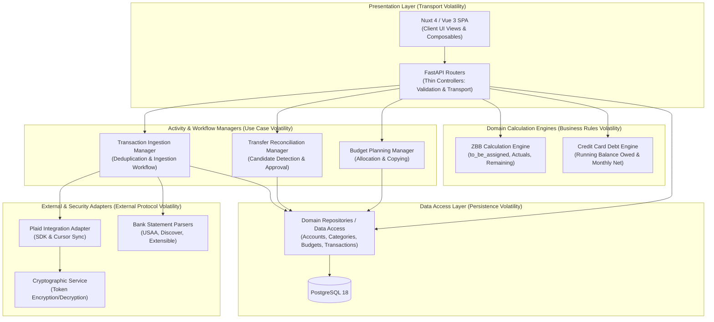

# Volatility Map & Decomposition Strategy

## 1. Overview
Rather than organizing the system around functional categories ("budgets", "categories", "transactions"), this volatility map decomposes the architecture along independent axes of change. Each significant area of volatility is identified, evaluated for its likelihood of change, and mapped to an architectural boundary.

---

## 2. Volatility Analysis Matrix

| System Component | Core Responsibility | Axis of Volatility (What Changes?) | Volatility Rate | Cascading Blast Radius Today | Architectural Boundary Required? |
|---|---|---|:---:|---|:---:|
| **Plaid Integration Adapter** | Plaid API interaction, token exchange, cursor sync | Plaid API changes, webhook integration, new bank providers (MX, Teller) | **High** | `routers/plaid.py`, `crud/plaid.py`, `crud/transaction.py`, `models.py` | **Yes** (External Resource Adapter) |
| **Bank Statement Parsers** | Parsing CSV/text exports, header mapping, sign normalization | New bank layouts (Chase, BoA), header adjustments, date formats, OFX/QIF support | **High** | `bank_statement_loader.py`, `routers/upload.py`, `schemas.py`, `upload.vue` | **Yes** (Ingestion Parser Boundary) |
| **Transaction Ingestion & Deduplication** | Verifying duplicate entries, ensuring ingestion idempotency | Duplicate criteria (hash match, fuzzy description match, posting date window) | **Medium-High** | `routers/upload.py`, `crud/transaction.py`, `crud/plaid.py` | **Yes** (Ingestion Activity Boundary) |
| **Zero-Based Budget Calculation Engine** | Pure mathematical calculations: ZBB actuals, remaining, `to_be_assigned` | Budget methodology changes, rollover balances, refund handling | **Medium** | Duplicated across `summaries.py` (`get_budget_summary` & `get_dashboard_summary`) | **Yes** (Domain Calculation Engine) |
| **Transfer Reconciliation Engine** | Heuristic matching of inter-account transfer pairs | Matching heuristics, date tolerance, merchant keyword matching, split transfers | **Medium-High** | Trapped inside `routers/credit_cards.py` | **Yes** (Domain Reconciliation Engine) |
| **Credit Card Debt Engine** | Calculating running debt balance, monthly charges, and payments | Statement cycle vs calendar month accounting, APR/interest tracking, payment minimums | **Medium** | `routers/credit_cards.py`, `credit-cards.vue` | **Yes** (Domain Liability Engine) |
| **Category Taxonomy & Ordering** | Category group and category hierarchies, reordering, active flags | Sub-categories, category icon/color metadata, soft-delete archiving | **Low-Medium** | `routers/categories.py`, `crud/category.py`, `models.py`, `categories.vue` | **Yes** (Domain Entity Boundary) |
| **Budget Planning & Allocation** | Monthly dollar allocation targets per category | Custom budget periods (bi-weekly), budget cloning, savings goal targets | **Medium** | `routers/budgets.py`, `crud/budget.py`, `models.py`, `categories.vue` | **Yes** (Domain Entity Boundary) |
| **Account & Balance Management** | Account types, subtypes, balances, active status | Multi-currency support, balance reconciliation adjustments, snapshot history | **Low-Medium** | `routers/accounts.py`, `models.py`, `accounts.vue`, `useAccountTypes.ts` | **Yes** (Domain Entity Boundary) |
| **Cryptographic Storage** | Encrypting and decrypting sensitive credentials | Replacing base64 with AES-GCM, Fernet, or KMS | **High** (Certain) | `security.py`, `crud/plaid.py`, `routers/plaid.py` | **Yes** (Security Utility Boundary) |
| **Relational Data Persistence** | SQL queries, table schemas, transactional sessions | DB optimizations, connection pooling, Alembic migrations | **Low-Medium** | Scattered across all `routers/` and `crud/` modules | **Yes** (Data Access Boundary) |
| **API Transport Layer** | FastAPI routing, serialization, HTTP status codes, CORS | Route restructuring, API versioning (`/api/v1`), adding authentication (JWT) | **Medium** | All router files in `backend/routers/` | **Yes** (Presentation Boundary) |
| **Client UI Views** | Visual layout, responsive rendering, component styling | UI redesigns, styling overhauls, responsive layout adjustments | **High** | `frontend/app/pages/*`, `app.vue` | **Yes** (Client Presentation Boundary) |

---

## 3. Proposed Architectural Boundaries

### Boundary Justifications
1. **Ingestion Adapters Boundary:** Protects internal data models from volatile third-party bank schemas, API deprecations, and varying CSV header formats.
2. **Core Calculation Engine Boundary:** Isolates the mathematical formulas of Zero-Based Budgeting from HTTP transport and database queries, enabling consistent reporting across dashboard, budget views, and automated tests.
3. **Transfer Reconciliation Engine Boundary:** Decouples transfer detection heuristics from credit cards and account storage, reflecting that inter-account transfers occur across all account types.
4. **Data Access Boundary:** Eliminates scattered raw SQLAlchemy queries from routers, centralizing persistence and transactional boundaries.
5. **Cryptographic Boundary:** Enables upgrading from base64 encoding to real encryption without touching ingestion workflows.

---

## 4. Anti-Patterns & Overengineering to Avoid

1. **Generic Repository Interfaces for Basic CRUD:**
   Introducing `IRepository<T>` with specification patterns for simple models like `CategoryGroup` or `Account` creates gratuitous boilerplate. Concrete data access modules are preferred.
2. **Pluggable Database Engine Abstraction:**
   Abstracting the database layer to support document stores or multiple SQL engines is unnecessary; the application fundamentally depends on relational guarantees and fixed-point decimals.
3. **Microservices / Distributed Message Queues:**
   Deploying Kafka, RabbitMQ, or Celery for a personal budgeting application would introduce substantial operational overhead and failure modes without benefit.
4. **Generic AST / DSL Rule Engine:**
   Writing an extensible rule execution engine for transfer matching or categorization is overengineering. Clean, deterministic Python functions are straightforward to test and maintain.
5. **Multi-Currency Conversion Systems:**
   The application strictly operates in USD decimals. Introducing forex exchange rate feeds or currency ledgers would be premature generalization.
