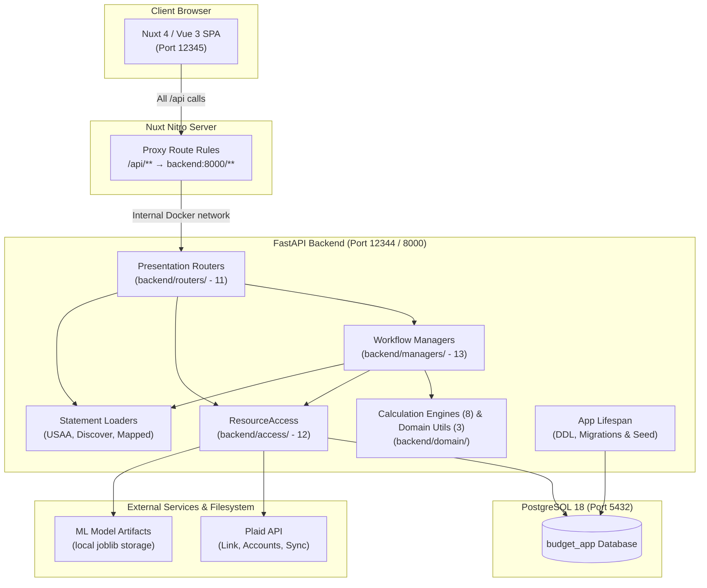

# System Architecture

This document describes the high-level architecture, design patterns, domain logic, and component interactions of the Personal Budget App.

---

## 1. System Overview

The Personal Budget App is a full-stack personal finance application designed around the **zero-based budgeting methodology** (assign every dollar a job). It supports dual ingestion methods for financial data: automated bank syncing via **Plaid** and manual statement importing via **CSV bank exports**.



---

## 2. Technology Stack

| Layer | Technology | Version / Details | Purpose |
|---|---|---|---|
| **Frontend Framework** | [Nuxt](https://nuxt.com/) | 4.2+ | Modern SSR/SPA framework with file-based routing and Vite |
| **UI Library** | [Vue.js](https://vuejs.org/) | 3.5+ | Composition API, `<script setup>`, reactive state, centralized tokens |
| **Drag & Drop** | [vuedraggable](https://github.com/SortableJS/vue.draggable.next) | 4.1+ | Reordering category groups and categories |
| **Backend Framework** | [FastAPI](https://fastapi.tiangolo.com/) | 0.115+ | High-performance Python web API with OpenAPI/Swagger docs |
| **ORM / Data Layer** | [SQLAlchemy](https://www.sqlalchemy.org/) | 2.x | Relational mapping, eager loading (`selectinload`, `joinedload`) |
| **Data Validation** | [Pydantic](https://docs.pydantic.dev/) | 2.x | Schema validation, `ConfigDict(from_attributes=True)`, `condecimal` |
| **Database** | [PostgreSQL](https://www.postgresql.org/) | 18 | Relational database with UUID keys and numeric decimals |
| **Machine Learning** | [scikit-learn](https://scikit-learn.org/) | 1.4+ | TF-IDF character n-gram text vectorization + Logistic Regression |
| **Bank Sync** | [Plaid Python SDK](https://github.com/plaid/plaid-python) | Latest | Bank authentication and transaction synchronization |
| **CSV Parsing** | Python Standard Library | `csv`, `io` | Custom statement parser abstraction for bank CSVs |
| **Containerization** | [Docker Compose](https://docs.docker.com/compose/) | 3.8+ | Multi-container orchestration (backend, frontend, postgres) |

---

## 3. Core Domain Concepts & Business Rules

### 3.1 Transaction Amount Sign Convention

All transaction records follow a strict accounting sign convention across the entire database:

$$\text{Outflow (Spending / Charges / Debits)} > 0 \quad (\text{Positive})$$
$$\text{Inflow (Income / Deposits / Credits)} < 0 \quad (\text{Negative})$$

- **Purchases & Expenses:** When money leaves an account (e.g. paying \$50 for groceries), `amount = 50.00`.
- **Income & Deposits:** When money enters an account (e.g. paycheck of \$2,500), `amount = -2500.00`.
- **Credit Card Charges:** Buying an item on credit increases balance owed; `amount = 45.00`.
- **Credit Card Payments:** Money sent from checking to credit card reduces debt; appears as `amount = -150.00` on the credit card account and `amount = 150.00` on the checking account.

### 3.2 Depository Account Balance Model

Depository accounts (checking, savings, cash) derive current balances from the transaction ledger:

$$\text{Current Balance} = \text{Starting Balance} - \sum_{\text{all-time}} \text{Transaction.amount}$$

Because outflows are positive in the ledger, subtracting them reduces liquid cash; negative inflows increase liquid cash.

### 3.3 Zero-Based Budgeting (ZBB) Calculation

The core philosophy assigns every dollar of expected income to a specific category:

$$\text{To Be Assigned} = \text{Total Income Planned} - \text{Total Expense Planned}$$

- When $\text{To Be Assigned} = 0$: **"Every dollar has a job!"** The budget is balanced.
- When $\text{To Be Assigned} > 0$: Unassigned funds remain to be allocated.
- When $\text{To Be Assigned} < 0$: The user is over-budgeted.

#### Monthly Category Actuals & Split Substitution Flow
Category actuals substitution occurs at the **ResourceAccess** boundary (`transaction_access.get_actuals_by_category`):
- For an **unsplit** transaction, the database query sums `Transaction.amount` grouped by `Transaction.category_id`.
- For a **split** transaction, the parent contributes zero directly; instead, the query sums `TransactionSplit.amount` grouped by `TransactionSplit.category_id`.
- The ResourceAccess layer returns a pre-aggregated mapping (`dict[UUID, Decimal]`) to `BudgetSummaryManager`.
- The pure **Budget Engine** ([`backend/domain/budgeting.py`](file:///Users/west/programming_stuff/budget_app/backend/domain/budgeting.py)) receives already-aggregated category totals and calculates:
  - **For `type == "expense"` categories:**
    - $\text{Actual} = \sum \text{allocated actuals}$ (where amount > 0 for outflows)
    - $\text{Remaining} = \text{Planned} - \text{Actual}$
    - $\text{Is Over Budget} = \text{Actual} > \text{Planned}$
  - **For `type == "income"` categories:**
    - Transactions for income are stored as negative numbers (inflow), so:
    - $\text{Actual} = -1 \times \sum \text{allocated actuals}$
    - $\text{Remaining} = \text{Planned} - \text{Actual}$
    - $\text{Is Over Budget} = \text{Actual} < \text{Planned}$

### 3.4 Credit Card Debt & Balance Model

Credit cards track revolving liability via the pure Credit Card Engine ([`backend/domain/credit_cards.py`](file:///Users/west/programming_stuff/budget_app/backend/domain/credit_cards.py)):

1. **Balance Owed Formula:**
   $$\text{Balance Owed} = \text{Starting Balance} + \sum_{\text{all-time}} \text{Transaction.amount}$$
   Since charges are positive and payments/credits are negative, the all-time net sum directly yields the current unpaid debt.
2. **Overpayment / Credit Balance:**
   When cumulative payments and credits exceed charges from a zero starting balance, $\text{Balance Owed} < 0$. The application displays this state as an "Overpayment / Credit Balance" rather than negative debt.
3. **Monthly Charges:**
   $$\text{Charges This Month} = \sum \text{Transaction.amount} \quad \text{where } \text{amount} > 0 \text{ and } \text{is\_transfer} = \text{False}$$
4. **Monthly Payments:**
   $$\text{Payments Received} = \left| \sum \text{Transaction.amount} \right| \quad \text{where } \text{amount} < 0$$

### 3.5 Automated Inter-Account Transfer Matching

Credit card payments or checking-to-savings transfers generate two distinct records:
1. An outflow on Account A (+X)
2. An inflow on Account B (-X)

The reconciliation engine in [`backend/domain/reconciliation.py`](file:///Users/west/programming_stuff/budget_app/backend/domain/reconciliation.py) (`detect_transfer_candidates`) provides automated pairing:
- Matches an unlinked inflow (`amount < 0`, `is_transfer == False`) with an unlinked outflow (`amount > 0`, `is_transfer == False`) across different accounts.
- Criteria: Identical absolute amount and $| \text{date}_{\text{outflow}} - \text{date}_{\text{inflow}} | \le 2\text{ days}$.
- Approving sets `is_transfer = True` on both transactions, excluding them from spending and income calculations.

### 3.6 Account Reconciliation Workflow

Reconciliation ensures the ledger agrees with the bank statement:
- Transactions carry `is_cleared` and `is_reconciled` flags.
- Reconciling checks:
  $$\text{Cleared Balance} = \text{Starting Balance} - \sum_{\text{cleared}} \text{Transaction.amount} \quad (\text{for depository})$$
- When $\text{Difference} = |\text{Cleared Balance} - \text{Statement Ending Balance}| = 0.00$, the user finalizes reconciliation.
- Finalization atomically locks participating transactions (`is_reconciled = True`) and updates the account watermark (`last_reconciled_date`, `last_reconciled_balance`).
- Reconciled transactions cannot have their financial fields (`amount`, `date`, `account_id`) modified or deleted.

### 3.7 Merchant Normalization & Categorization Rules

1. **Merchant Normalization Helper:**
   - Raw description is strictly preserved in `description`.
   - POS prefixes (`SQ *`, `TST*`), store IDs, and state codes are cleaned by `merchant_normalization.py` into a readable `merchant` and uppercase `clean_merchant_key`.
   - Manual overrides set `is_merchant_overridden = True` to prevent overwriting.
2. **Deterministic Rules Helper:**
   - Matches transactions by exact canonical merchant key (`clean_merchant_key(merchant)` &rarr; `category_id`).
   - One rule per canonical merchant (unique index). Listed alphabetically by canonical merchant.
   - Evaluated during transaction staging when `category_id IS NULL`.
   - Retroactive application is explicit and user-triggered via `POST /rules/{id}/apply`.

### 3.8 Machine Learning Suggestions

- Supervised pipeline: character n-gram TF-IDF (`char_wb`, 3–5) + Logistic Regression (`C=2.0`, balanced weights).
- Precedence: Explicit User Category > Deterministic Rule > ML Suggestion > Uncategorized.
- Suggestion-only: Never silently categorizes transactions.
- Operating threshold: Abstains below confidence score 0.30.
- Supervised provenance: Only `manual`, `ml`, and `legacy` categories are eligible for retraining; rules and unconfirmed predictions are excluded.
- Retraining: Synchronous on-demand retraining when $\ge 10$ new labels accumulate. Quality gates prevent regressions.

### 3.9 Recurring Transactions

- Identifies recurring series across posted, non-transfer transactions by `(account_id, clean_merchant_key, direction)`.
- Exact cadence semantics:
  - `weekly`: 5–9 days per interval; average interval in `[6.0, 8.0]` days.
  - `biweekly`: 11–17 days per interval; average interval in `[12.5, 15.5]` days.
  - `monthly`: 26–35 days per interval; calendar month difference == 1; day difference $\le 4$ days or month-end within 2 days.
  - `annual`: 355–375 days per interval; calendar month difference == 12; day difference $\le 5$ days or month-end within 2 days.
- Minimum evidence: $\ge 3$ posted occurrences (2 valid intervals).
- Statuses: `detected`, `confirmed`, `dismissed`.
- Projects informational `next_expected_date` without mutating ledger balances.

### 3.10 Split Transactions

- Parent transaction remains the sole financial event; child `TransactionSplit` records allocate categories.
- Sum invariant: $\sum \text{split.amount} == \text{parent.amount}$ with exact Decimal precision.
- Minimum 2 allocations, non-zero amounts, same sign as parent.
- While split: `parent.category_id = NULL` and `parent.category_source = NULL`.
- Plaid corrections: non-reconciled splits are deallocated/deleted on provider amount change; reconciled transactions block provider mutation and record conflict fields (`plaid_reconciliation_conflict_amount`, `plaid_reconciliation_conflict_at`).

---

## 4. Ingestion Architecture

```mermaid
flowchart LR
    subgraph BankSync ["Plaid Ingestion"]
        P1["Plaid Link UI"] -->|public_token| P2["POST /plaid/exchange_public_token"]
        P2 -->|Stores encrypted access_token| P3["PlaidItem in DB"]
        P4["POST /plaid/sync_transactions"] -->|Plaid Sync API / cursor| P5["Upsert Transactions"]
    end

    subgraph CSVIngestion ["CSV Statement Ingestion (Upload-First)"]
        C1["User selects CSV File"] --> C2["POST /upload/inspect"]
        C2 --> C3["Backend inspects headers & sample rows<br/>Auto-detects format"]
        C3 --> C4["Frontend Step 1: displays detection state<br/>(Optional: Save custom mapping)"]
        C4 --> C5["User selects Target Account & clicks Preview"]
        C5 --> C6["POST /upload/preview"]
        C6 --> C7["_resolve_statement_loader()<br/>(USAA, Discover, or Mapped)"]
        C7 -->|Parses & validates rows| C8["Step 3: Preview Table & Confirm Action"]
        C8 -->|User clicks Confirm / Import| C9["POST /upload/confirm"]
        C9 -->|Duplicate Check via csv_import_manager<br/>(account_id + date + amount + description)| C10["Step 4: Done (Import Results)"]
    end
```

---

## 5. Frontend Architecture

### 5.1 Page Layout & Navigation
The application uses a persistent sidebar defined in [`frontend/app/app.vue`](file:///Users/west/programming_stuff/budget_app/frontend/app/app.vue):
- **Dashboard (`/dashboard`):** Liquid cash, credit debt, spending by category group, actionable items, and recent transactions.
- **Categories & Budget (`/categories`):** Combined category manager and zero-based monthly budget planner with whole-row expansion and drag-and-drop reordering.
- **Transactions (`/transactions`):** Primary transaction workspace with persistent filters, full-text search, review toggles, transfer pairing modal, split allocation modal, and ML category suggestions.
- **Accounts (`/accounts`):** Ledger-derived balances, credit debt with overpayment indicators, and first-class Account Reconciliation modal.
- **Credit Cards (`/credit-cards`):** Specialized credit card debt tracking and monthly charge/payment breakdowns.
- **Upload (`/upload`):** Upload-first CSV statement ingestion wizard.
- **Settings (`/settings`):** Categorization rules management and ML status controls.
- **Index (`/`):** Redirects automatically to `/dashboard`.

### 5.2 Design Foundation & Composables
- **Design Tokens:** Centralized CSS tokens for typography, semantic colors, spacing, and elevation in `frontend/app/tokens.css` and `frontend/app/base.css`.
- **Reusable Components:** `MonthNavigator.vue` (unified month switching), `AppDialog.vue` (unified accessible modal patterns).
- **Shared Composables:** `useBudgetMonth.ts` (route-synchronized month state), `useTransactionFilters.ts` (route-query persistent filters), and `useAccountTypes.ts` (synchronized account types).
