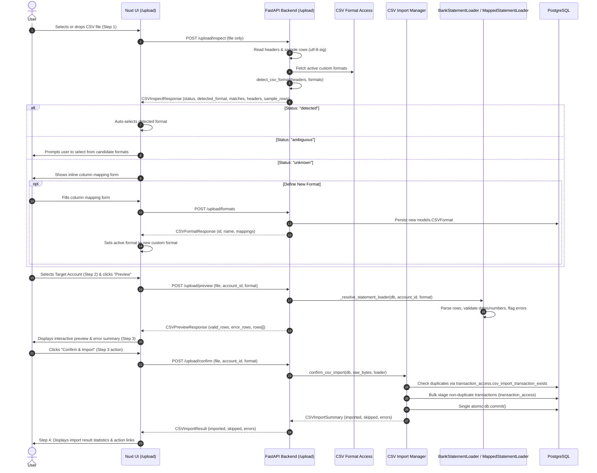

# Bank Statement CSV Import Guide

This guide explains how CSV statement parsing, header auto-detection, custom format configuration, and ingestion work in the Personal Budget App.

---

## 1. How It Works (Upload-First Workflow)

The CSV import pipeline enables users to import bank transactions without linking a live bank connection via Plaid.

The workflow is **upload-first** across four clear wizard steps:
1. **Step 1: Upload / Inspect / Resolve:** The user selects or drops a CSV file first. The backend inspects its structure and attempts automatic format detection (`POST /upload/inspect`). Substates handle `detected` (unique format matched), `ambiguous` (user chooses among candidate formats), and `unknown` (inline mapping form allows creating and saving a custom format via `POST /upload/formats`).
2. **Step 2: Account Selection:** The user selects the target destination account (or creates a new one inline).
3. **Step 3: Preview & Confirm:** The backend parses the file with the resolved format and returns row-by-row previews and non-fatal parsing errors (`POST /upload/preview`). The user reviews the preview table and clicks "Confirm / Import", which initiates `POST /upload/confirm`.
4. **Step 4: Done / Results:** Upon a successful response from `/upload/confirm`, the wizard transitions to Step 4 Done, displaying the completed import result statistics (imported count, skipped duplicate count, row errors) with actions to view transactions or upload another statement.



---

## 2. Format Categories

Under Volatility-Based Decomposition (VBD), `BankStatementLoader` and its subclasses represent an **ingestion/parsing boundary** adapting external bank CSV representations into the domain model. It is **not** a pure business calculation Engine.

The system supports two categories of statement formats:

### Built-in Formats

Hardcoded concrete subclasses in [`backend/bank_statement_loader.py`](file:///Users/west/programming_stuff/budget_app/backend/bank_statement_loader.py):

| Format Key | Bank / Card | Structurally Required CSV Headers | Date Format | Sign Convention in Bank Export | App Normalization |
|---|---|---|---|---|---|
| `usaa` | USAA Checking & Savings | `Date`, `Description`, `Category`, `Amount`, `Status` | `%Y-%m-%d` (e.g. `2026-05-24`) | Negative for debits/purchases; Positive for credits | **Inverted:** `-amount` so charges become positive |
| `discover` | Discover Credit Card | `Trans. Date`, `Description`, `Amount`, `Category` | `%m/%d/%Y` (e.g. `05/24/2026`) | Positive for charges; Negative for credits | **Preserved:** `amount` matches app convention |

> [!NOTE]
> **Source Bank Category vs. Budget Category:**
> For both USAA and Discover exports, `Category` is structurally required in the CSV header row by `column_map`. However, this represents the bank's own internal category categorization and is **not** mapped to the user's application budget category (`TransactionCreate.category_id` defaults to `None`).

### Custom Persisted Formats

Dynamic formats persisted in the `csv_formats` PostgreSQL table and parsed via [`MappedStatementLoader`](file:///Users/west/programming_stuff/budget_app/backend/bank_statement_loader.py#L264) using [`MappedCSVFormatConfig`](file:///Users/west/programming_stuff/budget_app/backend/bank_statement_loader.py#L215):

- Persisted fields: `name`, `date_column`, `description_column`, `amount_column`, `status_column`, `date_format`, `amount_sign_convention`, `status_posted_value`.
- Unique constraint: Case-insensitive name uniqueness enforced by `lower(name)` unique index.
- Status configuration & canonicalization rules:
  - If `status_column` is absent (`None`), `status_posted_value` is always canonicalized to `None`.
  - If `status_column` is present and the posted token is omitted or blank, `status_posted_value` defaults to `"posted"`.
  - If `status_column` is present and a custom token is supplied, the token is trimmed and lowercased (e.g. `"  CLEARED  "` becomes `"cleared"`).
- Semantic Duplicate Identity: A configuration is considered an exact semantic duplicate if another format exists with identical `date_column`, `description_column`, `amount_column`, `date_format`, `amount_sign_convention`, and status configuration (where either both have `status_column is None` with `status_posted_value` canonicalized to `None`, or both match on `status_column` and `lower(status_posted_value)`). Formats without a status column do not become semantically distinct because of irrelevant posted tokens.

---

## 3. Header Inspection & Format Auto-Detection

When a file is uploaded to `POST /upload/inspect`, the backend executes `detect_csv_format(headers, formats)`:

1. **Decoding & Header Reading:** The file stream is decoded using UTF-8 with BOM tolerance (`utf-8-sig`). Headers are read directly from the first row.
2. **Matching Rules:**
   - A format matches when its required headers are a subset of uploaded headers:
     $$\text{required\_headers} \subseteq \text{uploaded\_headers}$$
   - A CSV containing exactly the required headers matches. Extra unmapped columns in the CSV are also permitted.
   - Header comparison is **strictly exact**: case-sensitive, whitespace-sensitive, and punctuation-sensitive. (The helper `normalize_headers` merely casts non-empty elements and discards `None` or `""`; it does not lowercase or trim).
   - There is no fuzzy matching or scoring heuristic.
3. **Candidate Ordering:** Candidates are evaluated with built-in formats first (`usaa`, `discover`), followed by persisted custom formats in `list_custom_formats` order (`lower(name) ASC`). Candidate order is deterministic; no candidate is silently preferred.
4. **Detection Status:**
   - `detected`: Exactly one format matched. `detected_format` contains the format match.
   - `ambiguous`: Two or more formats matched. `matches` contains all candidate matches.
   - `unknown`: Zero formats matched.
5. **Sample Rows:** Positional list of up to 3 data rows (`sample_rows[row][column]` matches `headers[column]`) provided for UI mapping previews.

---

## 4. Duplicate Detection Logic

To prevent importing the same transaction twice when uploading overlapping monthly statements, [`backend/managers/csv_import_manager.py`](file:///Users/west/programming_stuff/budget_app/backend/managers/csv_import_manager.py) checks for duplicates via [`transaction_access.csv_import_transaction_exists`](file:///Users/west/programming_stuff/budget_app/backend/access/transaction_access.py#L130) before staging:

```python
if transaction_access.csv_import_transaction_exists(
    db,
    account_id=txn.account_id,
    transaction_date=txn.date,
    amount=txn.amount,
    description=txn.description,
):
    skipped += 1
    continue
```

If an identical transaction is found:
- The row is skipped without raising an error.
- The `skipped` counter in `CSVImportResult` is incremented.

---

## 5. Adding Support for New Formats

### Method A: Create a Custom Format (Recommended - No Code Changes)

Users can configure custom formats directly through the UI or REST API without writing code or redeploying the backend.

#### Via the Upload UI (`/upload`):
1. Drop the statement CSV into the upload dropzone.
2. If the format is unrecognized (status `unknown`), an inline column mapping form is displayed automatically with a positional sample of data rows.
3. Select which CSV columns correspond to **Date**, **Description**, and **Amount** from the dropdowns populated from the file headers.
4. Select the **Date Format** (e.g. `YYYY-MM-DD`, `MM/DD/YYYY`).
5. Choose the **Amount Sign Convention**:
   - *Positive is Inflow (`positive_is_inflow`)*: Deposits/inflows appear as positive numbers, and charges/outflows appear as negative numbers (like USAA checking). The app will invert amounts so charges become positive.
   - *Positive is Outflow (`positive_is_outflow`)*: Charges/outflows appear as positive numbers (like Discover credit card). The app will preserve amounts directly.
6. (Optional) Select a **Status Column** and specify the posted token (e.g. `Posted` or `Cleared`) to filter out pending transactions.
7. Click **"Save Format"**. The format is saved to PostgreSQL and immediately selected for the current import.

#### Via the REST API (`POST /upload/formats`):

```bash
curl -X POST http://localhost:8000/upload/formats \
  -H "Content-Type: application/json" \
  -d '{
    "name": "Chase Checking",
    "date_column": "Posting Date",
    "description_column": "Description",
    "amount_column": "Amount",
    "status_column": "Details",
    "date_format": "%m/%d/%Y",
    "amount_sign_convention": "positive_is_inflow",
    "status_posted_value": "posted"
  }'
```

### Method B: Adding Built-in Python Loaders (Code-Level)

For bank formats bundled natively with the app:
1. Subclass `BankStatementLoader` in [`backend/bank_statement_loader.py`](file:///Users/west/programming_stuff/budget_app/backend/bank_statement_loader.py).
2. Define `column_map` and implement `transform_row()`.
3. Register the class in `LOADER_REGISTRY` and define corresponding `CSVFormatMatchDefinition`.
4. Run regression tests with `python3 -m pytest tests/test_unit_csv_parsing.py`.
