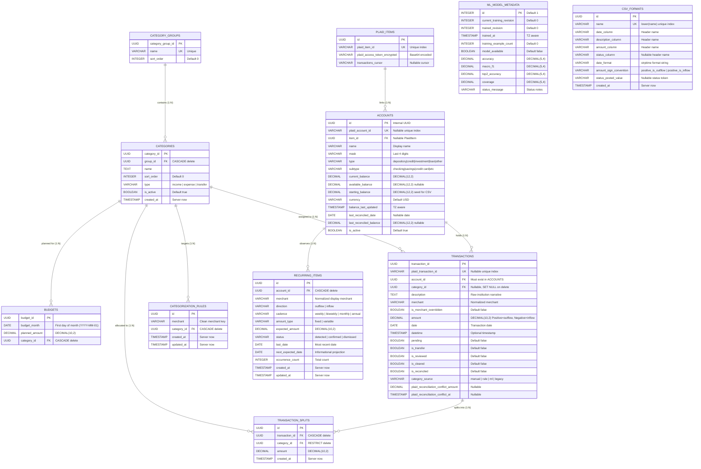

# Database Schema & Data Models

This document details the PostgreSQL schema, SQLAlchemy ORM models, relations, integrity constraints, and default seed data.

---

## 1. Entity-Relationship Diagram (ERD)

---

## 2. Table Definitions

### 2.1 `category_groups`
Represents top-level groupings such as "Housing", "Food", "Income", "Transportation".

| Column | Type | Nullable | Default | Description |
|---|---|---|---|---|
| `category_group_id` | UUID | No | `uuid.uuid4()` | Primary key |
| `name` | VARCHAR | No | - | Unique group name |
| `sort_order` | INTEGER | No | `0` | Order displayed in UI |

**Relationships:**
- `categories`: One-to-many relationship with `Category`. Deleting a group cascades (`cascade="all, delete-orphan"`).

---

### 2.2 `categories`
Individual sub-categories (e.g. "Groceries", "Rent/Mortgage", "Paycheck").

| Column | Type | Nullable | Default | Description |
|---|---|---|---|---|
| `category_id` | UUID | No | `uuid.uuid4()` | Primary key |
| `group_id` | UUID | No | - | Foreign key &rarr; `category_groups.category_group_id` |
| `name` | TEXT | No | - | Category display name |
| `sort_order` | INTEGER | No | `0` | Position inside parent group |
| `type` | VARCHAR | No | `'expense'` | `'income'`, `'expense'`, or `'transfer'` |
| `is_active` | BOOLEAN | No | `True` | Soft-disable flag |
| `created_at` | TIMESTAMP | No | `func.now()` | Creation timestamp |

**Constraints:**
- `uq_category_group_name`: `UNIQUE(group_id, name)` (Category names must be unique within their group).
- Foreign Key: `ON DELETE CASCADE` from `category_groups`.

**Relationships:**
- `group`: Back-populates `CategoryGroup.categories`.
- `budgets`: One-to-many with `Budget` (`cascade="all, delete-orphan"`).
- `transactions`: One-to-many with `Transaction`. Deleting a category sets `Transaction.category_id` to `NULL`.
- `splits`: One-to-many with `TransactionSplit`. Deleting a category is restricted (`ON DELETE RESTRICT`).
- `categorization_rules`: One-to-many with `CategorizationRule` (`cascade="all, delete-orphan"`).

---

### 2.3 `budgets`
Allocated monthly plan per category.

| Column | Type | Nullable | Default | Description |
|---|---|---|---|---|
| `budget_id` | UUID | No | `uuid.uuid4()` | Primary key |
| `budget_month` | DATE | No | - | Normalized to 1st of month (`YYYY-MM-01`) |
| `planned_amount` | DECIMAL(10,2) | No | - | Dollar amount planned for category |
| `category_id` | UUID | No | - | Foreign key &rarr; `categories.category_id` |

**Constraints:**
- `_budget_month_category_uc`: `UNIQUE(budget_month, category_id)` (A category can only have one plan per month).
- Foreign Key: `ON DELETE CASCADE` from `categories`.

---

### 2.4 `accounts`
Financial accounts (checking, savings, credit cards, manual accounts, Plaid-linked).

| Column | Type | Nullable | Default | Description |
|---|---|---|---|---|
| `id` | UUID | No | `uuid.uuid4()` | Primary key |
| `plaid_account_id` | VARCHAR | Yes | - | Plaid account identifier (unique index) |
| `item_id` | UUID | Yes | - | Foreign key &rarr; `plaid_items.id` |
| `name` | VARCHAR | No | - | Account name (e.g. "USAA Checking") |
| `mask` | VARCHAR | Yes | - | Last 4 digits (e.g. "4921") |
| `type` | VARCHAR | No | - | Standardized type: `depository`, `credit`, `investment`, `loan`, `other` |
| `subtype` | VARCHAR | Yes | - | Detailed subtype: `checking`, `savings`, `credit card`, `mortgage`, etc. |
| `current_balance` | DECIMAL(12,2) | No | `0.00` | Ledger-derived depository current balance or Plaid remote balance |
| `available_balance` | DECIMAL(12,2) | Yes | - | Available balance (if reported by Plaid) |
| `starting_balance` | DECIMAL(12,2) | No | `0.00` | Baseline opening balance (used for manual accounts & credit cards) |
| `currency` | VARCHAR | No | `'USD'` | ISO currency code |
| `balance_last_updated` | TIMESTAMP(TZ) | Yes | - | Timestamp of last balance refresh |
| `last_reconciled_date` | DATE | Yes | - | Date of most recently completed account reconciliation |
| `last_reconciled_balance` | DECIMAL(12,2) | Yes | - | Target statement balance from last reconciliation |
| `is_active` | BOOLEAN | No | `True` | Active status flag |

---

### 2.5 `transactions`
Financial ledger records imported via Plaid or CSV.

| Column | Type | Nullable | Default | Description |
|---|---|---|---|---|
| `transaction_id` | UUID | No | `uuid.uuid4()` | Primary key |
| `plaid_transaction_id`| VARCHAR | Yes | - | Unique Plaid transaction identifier |
| `account_id` | UUID | No | - | Foreign key &rarr; `accounts.id` |
| `category_id` | UUID | Yes | - | Foreign key &rarr; `categories.category_id` (`ON DELETE SET NULL`) |
| `description` | TEXT | Yes | - | Raw bank narrative |
| `merchant` | VARCHAR | Yes | - | Clean, normalized merchant name |
| `is_merchant_overridden` | BOOLEAN | No | `False` | True if merchant name was manually edited |
| `amount` | DECIMAL(10,2) | No | - | **Positive = outflow / debit; Negative = inflow / credit** |
| `date` | DATE | No | - | Posted transaction date |
| `datetime` | TIMESTAMP(TZ) | Yes | - | Exact timestamp if provided |
| `pending` | BOOLEAN | No | `False` | True if transaction is still pending |
| `is_transfer` | BOOLEAN | No | `False` | True if marked as an inter-account transfer |
| `is_reviewed` | BOOLEAN | No | `False` | True if user reviewed and approved transaction |
| `is_cleared` | BOOLEAN | No | `False` | True if transaction cleared bank statement |
| `is_reconciled` | BOOLEAN | No | `False` | True if transaction is locked by account reconciliation |
| `category_source` | VARCHAR(20) | Yes | - | `'manual'`, `'rule'`, `'ml'`, or `'legacy'` |
| `plaid_reconciliation_conflict_amount` | DECIMAL(10,2) | Yes | - | Discrepancy amount reported by Plaid on reconciled transaction |
| `plaid_reconciliation_conflict_at` | TIMESTAMP | Yes | - | Timestamp when Plaid conflict was recorded |

---

### 2.6 `transaction_splits`
Category allocation lines for split transactions. One parent `Transaction` remains the sole financial event.

| Column | Type | Nullable | Default | Description |
|---|---|---|---|---|
| `id` | UUID | No | `uuid.uuid4()` | Primary key |
| `transaction_id` | UUID | No | - | Foreign key &rarr; `transactions.transaction_id` (`ON DELETE CASCADE`) |
| `category_id` | UUID | No | - | Foreign key &rarr; `categories.category_id` (`ON DELETE RESTRICT`) |
| `amount` | DECIMAL(10,2) | No | - | Category portion (must sum exactly to parent transaction amount) |
| `created_at` | TIMESTAMP | No | `func.now()` | Creation timestamp |

**Constraints:**
- `uq_transaction_splits_tx_cat`: `UNIQUE(transaction_id, category_id)`

---

### 2.7 `categorization_rules`
Deterministic merchant-to-category matching rules.

| Column | Type | Nullable | Default | Description |
|---|---|---|---|---|
| `id` | UUID | No | `uuid.uuid4()` | Primary key |
| `merchant` | VARCHAR | No | - | Target merchant matching string |
| `category_id` | UUID | No | - | Foreign key &rarr; `categories.category_id` (`ON DELETE CASCADE`) |
| `created_at` | TIMESTAMP | No | `func.now()` | Creation timestamp |
| `updated_at` | TIMESTAMP | No | `func.now()` | Last update timestamp |

**Constraints & Indexes:**
- `uq_categorization_rules_merchant_canonical`: `UNIQUE INDEX (lower(trim(merchant)))`

---

### 2.8 `ml_model_metadata`
Local machine learning model training state, revisions, and quality metrics.

| Column | Type | Nullable | Default | Description |
|---|---|---|---|---|
| `id` | INTEGER | No | `1` | Singleton primary key |
| `current_training_revision` | INTEGER | No | `0` | Incremented when user confirms/updates categories |
| `trained_revision` | INTEGER | No | `0` | Revision watermark of active deployed model |
| `trained_at` | TIMESTAMP(TZ) | Yes | - | Timestamp when model was trained |
| `training_example_count` | INTEGER | No | `0` | Count of supervised examples in training set |
| `model_available` | BOOLEAN | No | `False` | True if model artifact is serialized on disk |
| `accuracy` | DECIMAL(5,4) | Yes | - | Test accuracy score |
| `macro_f1` | DECIMAL(5,4) | Yes | - | Macro F1 score |
| `top2_accuracy` | DECIMAL(5,4) | Yes | - | Top-2 accuracy score |
| `coverage` | DECIMAL(5,4) | Yes | - | Proportion of suggestions meeting threshold |
| `status_message` | VARCHAR | Yes | - | Human-readable training status or error message |

---

### 2.9 `recurring_items`
Pattern-detected repeating transactions across accounts.

| Column | Type | Nullable | Default | Description |
|---|---|---|---|---|
| `id` | UUID | No | `uuid.uuid4()` | Primary key |
| `account_id` | UUID | No | - | Foreign key &rarr; `accounts.id` (`ON DELETE CASCADE`) |
| `merchant` | VARCHAR | No | - | Normalized display merchant name |
| `direction` | VARCHAR(10) | No | - | `'outflow'` or `'inflow'` |
| `cadence` | VARCHAR(20) | No | - | `'weekly'`, `'biweekly'`, `'monthly'`, `'annual'` |
| `amount_type` | VARCHAR(20) | No | `'fixed'` | `'fixed'` or `'variable'` |
| `expected_amount` | DECIMAL(10,2) | No | - | Mean or representative expected transaction amount |
| `status` | VARCHAR(20) | No | `'detected'` | `'detected'`, `'confirmed'`, `'dismissed'` |
| `last_date` | DATE | No | - | Date of most recent occurrence |
| `next_expected_date` | DATE | Yes | - | Projected next occurrence date |
| `occurrence_count` | INTEGER | No | `0` | Number of observed historical occurrences |
| `created_at` | TIMESTAMP | No | `func.now()` | Creation timestamp |
| `updated_at` | TIMESTAMP | No | `func.now()` | Last update timestamp |

**Constraints & Indexes:**
- `uq_recurring_items_identity`: `UNIQUE INDEX (account_id, lower(trim(merchant)), direction, cadence)`

---

### 2.10 `plaid_items`
Represents an authorized bank connection via Plaid.

| Column | Type | Nullable | Default | Description |
|---|---|---|---|---|
| `id` | UUID | No | `uuid.uuid4()` | Internal UUID primary key |
| `plaid_item_id` | VARCHAR | No | - | Unique Plaid Item identifier |
| `plaid_access_token_encrypted` | VARCHAR | No | - | Encrypted access token (base64 placeholder) |
| `transactions_cursor` | VARCHAR | Yes | - | Plaid sync cursor for incremental updates |

---

### 2.11 `csv_formats`
Represents persisted custom bank statement configurations for dynamic CSV import mapping.

| Column | Type | Nullable | Default | Description |
|---|---|---|---|---|
| `id` | UUID | No | `uuid.uuid4()` | Primary key |
| `name` | VARCHAR(100) | No | - | Display name of the format |
| `date_column` | VARCHAR(100) | No | - | Name of CSV column containing transaction dates |
| `description_column` | VARCHAR(100) | No | - | Name of CSV column containing transaction descriptions |
| `amount_column` | VARCHAR(100) | No | - | Name of CSV column containing transaction amounts |
| `status_column` | VARCHAR(100) | Yes | `None` | Optional CSV column containing transaction status |
| `date_format` | VARCHAR(50) | No | - | `strptime` format string (e.g. `%m/%d/%Y`, `%Y-%m-%d`) |
| `amount_sign_convention` | VARCHAR(30) | No | - | `'positive_is_outflow'` or `'positive_is_inflow'` |
| `status_posted_value` | VARCHAR(50) | Yes | `None` | Status token indicating posted status |
| `created_at` | TIMESTAMP | No | `func.now()` | Creation timestamp |

**Constraints & Indexes:**
- `uq_csv_formats_name_lower`: `UNIQUE INDEX (lower(name))`
- `chk_csv_formats_amount_sign_convention`: `CHECK (amount_sign_convention IN ('positive_is_outflow', 'positive_is_inflow'))`

---

## 3. Precision & Decimal Handling

All monetary amounts use fixed-point decimals:
- `Budget.planned_amount`: `DECIMAL(10, 2)`
- `Transaction.amount`: `DECIMAL(10, 2)`
- `TransactionSplit.amount`: `DECIMAL(10, 2)`
- `RecurringItem.expected_amount`: `DECIMAL(10, 2)`
- `Account.*_balance`: `DECIMAL(12, 2)`
- Pydantic validation enforces `condecimal(max_digits=10, decimal_places=2)` to prevent floating-point rounding errors.

---

## 4. Default Seed Data

On startup, [`backend/main.py`](file:///Users/west/programming_stuff/budget_app/backend/main.py) calls `init_db(db)` in [`backend/initial_data.py`](file:///Users/west/programming_stuff/budget_app/backend/initial_data.py):
1. **Income** (`sort_order: 0`): `Paycheck`, `Bonus`, `Interest`
2. **Saving** (`sort_order: 0`): `House Fund`
3. **Housing** (`sort_order: 1`): `Rent/Mortgage`, `Utilities`, `Maintenance`
4. **Food** (`sort_order: 2`): `Groceries`, `Restaurants`
5. **Transportation** (`sort_order: 3`): `Fuel`, `Public Transit`
